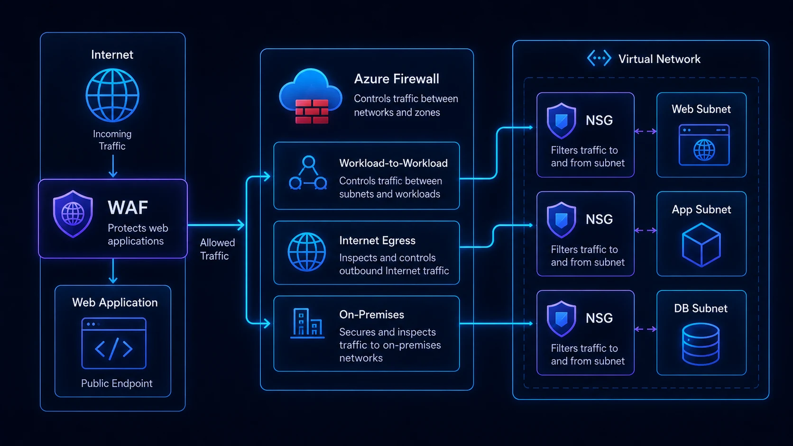

Al diseñar seguridad de red en Azure aparece una pregunta recurrente: **si ya tengo un NSG, ¿necesito Azure Firewall? ¿Y dónde entra WAF?**

Los tres controles pueden participar en la misma arquitectura porque resuelven problemas diferentes.

Una forma sencilla de entenderlos es:

```text
WAF             → protege aplicaciones web HTTP/S
Azure Firewall  → controla tráfico de red centralizado
NSG             → filtra tráfico cerca de subnets y recursos
```

No son reemplazos directos.



## Comparación rápida

| Característica | NSG | Azure Firewall | WAF |
|---|---|---|---|
| Enfoque principal | Filtrado de red | Firewall administrado central | Protección de aplicaciones web |
| HTTP/S | Sí, por IP/puerto | Sí | Sí, con contexto web |
| Protocolos no web | Sí | Sí | No |
| Inspección de ataques web | No | Limitada al propósito firewall | Sí |
| Filtrado central de egress | No como servicio central | Sí | No |
| Asociación típica | Subnet/NIC | VNet/hub | App Gateway/Front Door |
| Reglas L3/L4 | Sí | Sí | No es su función |
| Protección OWASP | No | No como WAF | Sí |

La clave es identificar qué flujo intentamos proteger.

## Network Security Groups

Un **Network Security Group (NSG)** contiene reglas que permiten o deniegan tráfico inbound y outbound.

Una regla considera propiedades como:

- origen;
- destino;
- puerto;
- protocolo;
- dirección;
- prioridad.

Por ejemplo:

```text
Allow
Source: 10.10.1.0/24
Destination: 10.10.2.0/24
Port: 443
Protocol: TCP
```

Los NSG se asocian comúnmente con subnets o interfaces de red.

### Cuándo utilizar NSG

Son adecuados para segmentación local:

- Web subnet sólo puede hablar con App subnet por 443.
- App subnet sólo puede hablar con DB subnet por 1433.
- administración sólo desde una red autorizada.
- bloquear exposición no requerida.

Un NSG es excelente para aplicar el principio de mínimo acceso entre segmentos.

### Qué no hace un NSG

No analiza una petición HTTP buscando SQL injection.

Tampoco funciona como un firewall de egress basado en navegación de aplicaciones ni ofrece el mismo modelo centralizado que Azure Firewall.

Puede filtrar:

```text
IP + puerto + protocolo
```

pero no entiende la intención de una petición web.

## Azure Firewall

**Azure Firewall** es un firewall administrado como servicio que permite centralizar políticas y controlar tráfico entre redes, Internet y entornos híbridos.

Es especialmente útil en arquitecturas Hub & Spoke.

Ejemplo:

```text
Spoke A ─┐
Spoke B ─┼─→ Azure Firewall → Internet
Spoke C ─┘
                  │
             On-premises
```

Esto permite disponer de un punto común para políticas y logging.

### Escenarios típicos

- salida controlada a Internet;
- tráfico spoke-to-spoke;
- comunicación Azure ↔ on-premises;
- DNAT para determinados servicios;
- políticas centralizadas;
- inspección adicional con Azure Firewall Premium.

### Firewall Standard y Premium

La elección depende del nivel de inspección requerido.

Premium incorpora capacidades de seguridad adicionales como IDPS y TLS inspection para determinados escenarios.

Pero ni siquiera Firewall Premium reemplaza el papel específico de un WAF para ataques a aplicaciones web.

## Web Application Firewall

Un **Web Application Firewall (WAF)** protege tráfico **HTTP/S** entendiendo elementos de la aplicación web.

Puede ayudar a detectar y bloquear patrones asociados con ataques como:

- SQL injection;
- cross-site scripting;
- manipulación de protocolo;
- ataques incluidos en reglas administradas;
- patrones maliciosos de requests.

En Azure suele encontrarse asociado a:

- Azure Application Gateway;
- Azure Front Door.

Su ubicación depende de la arquitectura.

## Ejemplo: aplicación web pública

Consideremos:

```text
Internet
   │
Application Gateway + WAF
   │
Web tier
   │
App tier
   │
Database
```

Podríamos utilizar:

**WAF**

Para inspeccionar solicitudes HTTP/S antes de llegar a la aplicación.

**NSG**

Para permitir únicamente:

```text
Web → App : 443
App → DB : 1433
```

**Azure Firewall**

Para controlar:

```text
workload → Internet
workload → on-premises
spoke → spoke
```

Los tres aportan controles complementarios.

## ¿Azure Firewall debe estar antes o después de Application Gateway?

No existe una única respuesta.

Microsoft documenta varios patrones.

### Application Gateway y Firewall en paralelo

Es un diseño frecuente:

```text
Internet → App Gateway/WAF → Web workload

Workload → Azure Firewall → Internet
```

El tráfico web inbound no necesita recorrer Azure Firewall si WAF proporciona la protección requerida y el firewall se utiliza para otros flujos.

Esto reduce complejidad.

### Application Gateway → Azure Firewall

Puede utilizarse cuando también se necesita que Azure Firewall inspeccione tráfico entre Application Gateway y backend.

```text
Internet
   ↓
App Gateway + WAF
   ↓
Azure Firewall
   ↓
Backend
```

La arquitectura requiere analizar routing y capacidades de inspección.

### Azure Firewall → Application Gateway

También es técnicamente posible, pero Microsoft señala que para HTTPS el valor adicional puede ser limitado cuando el firewall no descifra ese tráfico.

Por eso no debería agregarse simplemente para "tener dos firewalls".

## ¿NSG sigue siendo necesario si tengo Azure Firewall?

En muchos escenarios, sí.

Azure Firewall proporciona control central y NSG implementa segmentación local.

Ejemplo:

```text
Azure Firewall
    │
Spoke
├── Web subnet NSG
├── App subnet NSG
└── DB subnet NSG
```

Si una ruta cambia o aparece comunicación lateral inesperada, los NSG siguen aplicando controles cerca del workload.

Este enfoque corresponde al concepto de **defense in depth**.

## ¿WAF protege cualquier aplicación?

No.

WAF está diseñado para tráfico web.

Si tienes:

- SSH;
- RDP;
- SQL;
- SAP;
- MQTT;
- protocolos propietarios;

WAF no es el control adecuado.

Para esos casos se utilizan controles de red como NSG y Azure Firewall según el flujo.

## Caso 1: VM interna

```text
Usuario corporativo
     │
ExpressRoute
     │
Azure Firewall
     │
NSG
     │
VM
```

Probablemente no necesitas WAF si no existe una aplicación HTTP/S expuesta.

## Caso 2: sitio web público

```text
Internet
   │
Front Door + WAF
   │
Application
   │
NSG / Private connectivity
```

Azure Firewall podría añadirse para egress u otros flujos, pero no necesariamente tiene que estar inline con cada petición web.

## Caso 3: arquitectura híbrida Hub & Spoke

```text
Internet
   │
App Gateway + WAF
   │
Spoke Web
      │
      └── Azure Firewall ─── Datacenter
              │
            Internet
```

Aquí cada componente resuelve una necesidad diferente.

## Un error frecuente: "todo debe pasar por el firewall"

Forzar absolutamente todo el tráfico a través de Azure Firewall puede parecer más seguro, pero puede introducir:

- routing asimétrico;
- latencia;
- costos;
- dependencias;
- troubleshooting complejo.

Cada flujo debería justificar su inspección.

No todas las comunicaciones internas necesitan la misma ruta.

## Otro error: permitir Any-Any y confiar en el firewall

Una regla NSG como:

```text
Source: Any
Destination: Any
Port: Any
Action: Allow
```

reduce drásticamente la segmentación.

El firewall central no debería ser una excusa para eliminar controles locales.

## Logging

Una estrategia operativa debería permitir investigar:

- qué tráfico fue permitido;
- qué regla lo permitió;
- qué tráfico fue bloqueado;
- qué aplicación originó una conexión;
- qué patrón WAF fue detectado.

Los logs deben centralizarse de acuerdo con la estrategia de observabilidad y SIEM.

Microsoft Sentinel puede formar parte de la arquitectura, pero retención e ingestión deben evaluarse también desde costos.

## Matriz de decisión

| Necesidad | Control principal |
|---|---|
| Bloquear puerto 22 entre subnets | NSG |
| Restringir DB a App subnet | NSG |
| Centralizar salida a Internet | Azure Firewall |
| Filtrar por reglas de aplicación/FQDN | Azure Firewall |
| Proteger contra SQL injection web | WAF |
| Proteger aplicación HTTP pública | WAF |
| Controlar tráfico híbrido | Azure Firewall |
| Microsegmentar subnets | NSG |
| Protección multicapa | Combinación |

## Preguntas antes de decidir

1. ¿El tráfico es HTTP/S?
2. ¿Es inbound, outbound o lateral?
3. ¿Se necesita inspección de contenido?
4. ¿Se requiere control centralizado?
5. ¿Cuál es el origen y destino?
6. ¿Qué pasa si el control central deja de participar en la ruta?
7. ¿Cuál es el impacto de latencia?
8. ¿Cuál es el costo del servicio?
9. ¿Quién administrará las reglas?
10. ¿Cómo se investigarán incidentes?

## Conclusión

**NSG, Azure Firewall y WAF pertenecen a capas distintas de seguridad.**

Una arquitectura madura evita la pregunta "¿cuál de los tres debo comprar?" y la reemplaza por:

> ¿Qué flujos existen y qué controles necesita cada uno?

Usa NSG para segmentación cercana al workload, Azure Firewall para políticas centralizadas de red y WAF para proteger aplicaciones HTTP/S.

La seguridad mejora cuando cada componente tiene un propósito definido y no cuando simplemente acumulamos appliances en el diagrama.

## Fuentes oficiales

- [Network security groups overview](https://learn.microsoft.com/en-us/azure/virtual-network/network-security-groups-overview)
- [Azure Firewall overview](https://learn.microsoft.com/en-us/azure/firewall/overview)
- [Azure Web Application Firewall overview](https://learn.microsoft.com/en-us/azure/web-application-firewall/overview)
- [Azure Firewall and Application Gateway for virtual networks](https://learn.microsoft.com/en-us/azure/architecture/example-scenario/gateway/firewall-application-gateway)
- [Azure network security overview](https://learn.microsoft.com/en-us/azure/security/fundamentals/network-overview)
