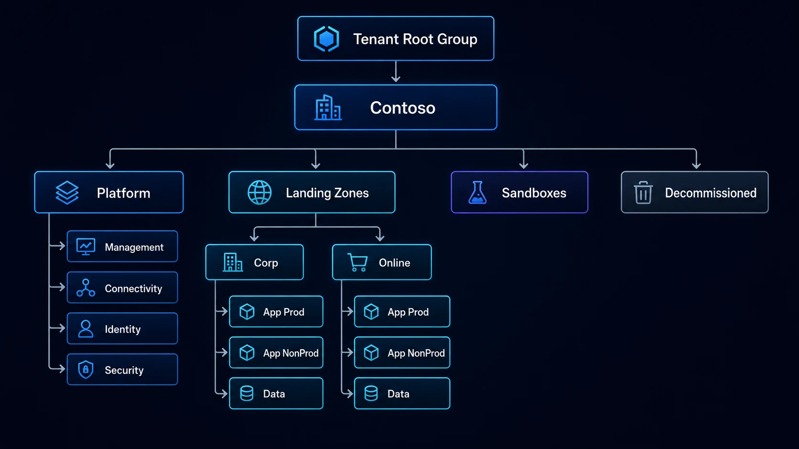

Adoptar Azure no consiste únicamente en crear suscripciones y comenzar a desplegar recursos. Esa estrategia puede funcionar durante una prueba de concepto, pero cuando aparecen múltiples equipos, aplicaciones, ambientes, requisitos de seguridad y centros de costo, la falta de una estructura común empieza a generar deuda operativa.

Una **Azure Landing Zone** busca resolver precisamente ese problema: establecer una base repetible para que los workloads lleguen a Azure sobre un entorno que ya incorpora decisiones de gobierno, identidad, conectividad, seguridad, administración y automatización.

Microsoft define Azure Landing Zones como la arquitectura recomendada para gobernar, proteger y escalar un entorno Azure de múltiples suscripciones. No es un producto que se compra ni una plantilla que deba desplegarse sin cambios. Es un modelo arquitectónico que debe adaptarse al operating model, regulación, escala y madurez de cada organización.



## Landing Zone no significa "una suscripción preparada"

Uno de los errores más frecuentes es llamar landing zone a una única suscripción que contiene una VNet, algunos NSG y una política de etiquetas.

Una implementación empresarial normalmente tiene dos grandes componentes:

- **Platform landing zone:** servicios compartidos y capacidades centrales.
- **Application landing zones:** suscripciones donde viven las aplicaciones y workloads.

La plataforma establece las reglas del juego. Los equipos de aplicación consumen esa plataforma sin tener que reconstruir identidad, conectividad, logging y gobierno cada vez que incorporan una nueva solución.

Este enfoque también permite separar responsabilidades. El equipo central puede administrar capacidades transversales mientras que los equipos de producto conservan autonomía dentro de límites previamente definidos.

## Las ocho áreas de diseño

La arquitectura de referencia de Azure Landing Zones está organizada alrededor de ocho áreas que deberían analizarse antes de desplegar la plataforma.

| Área | Pregunta que debe responder |
|---|---|
| Billing y tenant | ¿Cómo se relacionan contratos, tenant y estructura financiera? |
| Identidad y acceso | ¿Quién administra qué y bajo qué modelo de privilegios? |
| Organización de recursos | ¿Cómo se estructuran management groups y suscripciones? |
| Red y conectividad | ¿Cómo se conectarán workloads, Internet y on-premises? |
| Seguridad | ¿Qué controles preventivos, detectivos y de respuesta existirán? |
| Administración | ¿Cómo se monitorea, respalda y opera la plataforma? |
| Gobierno | ¿Qué estándares se aplicarán mediante Azure Policy y procesos? |
| Automatización y DevOps | ¿Cómo se desplegará y evolucionará la plataforma de forma controlada? |

Diseñar solamente la red y después agregar gobierno o seguridad al final suele producir retrabajo. Una landing zone efectiva considera estas áreas como partes del mismo sistema.

## Management groups: organiza por gobierno, no por organigrama

Los **management groups** permiten aplicar RBAC y Azure Policy por encima del nivel de suscripción. Esto los convierte en una pieza fundamental para establecer controles consistentes a escala.

Una estructura simplificada puede verse así:

```text
Tenant Root Group
└── Contoso
    ├── Platform
    │   ├── Management
    │   ├── Connectivity
    │   ├── Identity
    │   └── Security
    ├── Landing Zones
    │   ├── Corp
    │   └── Online
    ├── Sandboxes
    └── Decommissioned
```

La jerarquía no debería copiar automáticamente el organigrama empresarial. Los departamentos cambian con frecuencia; los requerimientos de política y operación suelen ser más estables.

Tampoco conviene crear management groups sólo porque existen distintas regiones. Microsoft recomienda utilizar la jerarquía estándar para escenarios multirregión y modificarla por ubicación únicamente cuando existan requisitos regulatorios como residencia o soberanía de datos.

## Suscripciones como unidad de escala

Una suscripción es más que una frontera de facturación. También es una frontera de:

- límites y cuotas;
- asignaciones RBAC;
- políticas;
- administración del ciclo de vida;
- blast radius;
- ownership;
- separación de ambientes.

Una buena estrategia evita dos extremos: una sola suscripción para todo o una proliferación innecesaria de suscripciones sin modelo de operación.

Por ejemplo, una organización podría dedicar suscripciones separadas para:

```text
Platform-Connectivity
Platform-Management
Platform-Security
App-Payments-Prod
App-Payments-NonProd
App-CRM-Prod
App-CRM-NonProd
Sandbox-TeamA
```

La decisión depende de criticidad, segregación, límites, regulación, ownership y modelo financiero.

## Conectividad: Hub & Spoke, Virtual WAN o conectividad distribuida

La landing zone no obliga a utilizar una única topología de red. En organizaciones con conectividad híbrida y servicios centralizados, **Hub & Spoke** continúa siendo un patrón muy utilizado.

El hub puede concentrar componentes como:

- ExpressRoute o VPN Gateway;
- Azure Firewall;
- DNS Private Resolver;
- Azure Bastion;
- servicios de inspección;
- conectividad con datacenter;
- servicios compartidos de red.

Los spokes alojan workloads y se conectan al hub mediante peering.

Para organizaciones con muchas regiones, sucursales o conectividad global compleja, **Azure Virtual WAN** puede reducir parte de la administración manual.

La decisión no debería comenzar preguntando "¿qué arquitectura está de moda?", sino:

1. ¿Cuántas regiones existen?
2. ¿Cuántas redes y sucursales?
3. ¿Existe conectividad on-premises?
4. ¿Quién administra el routing?
5. ¿Se requiere inspección centralizada?
6. ¿Qué volumen de crecimiento se espera?
7. ¿Qué dependencias existen entre workloads?

## Identidad: privilegios mínimos desde el diseño

Una plataforma empresarial necesita definir con claridad quién administra el tenant, la plataforma y cada workload.

Entre las prácticas relevantes se encuentran:

- separar roles de plataforma y aplicación;
- utilizar grupos de Microsoft Entra ID en lugar de asignaciones individuales;
- minimizar roles permanentes privilegiados;
- utilizar Privileged Identity Management cuando corresponda;
- evitar Owner de manera generalizada;
- usar identidades administradas para workloads siempre que sea posible;
- revisar periódicamente asignaciones RBAC.

La automatización también debe utilizar identidades con el mínimo privilegio. Una pipeline de aplicación no debería tener permisos administrativos sobre toda la jerarquía de management groups.

## Azure Policy: convertir estándares en controles

Documentar una regla en Confluence no garantiza que se cumpla. **Azure Policy** permite convertir parte del gobierno en controles evaluables y, en ciertos escenarios, aplicables automáticamente.

Ejemplos:

- restringir regiones permitidas;
- exigir etiquetas;
- auditar cifrado;
- desplegar diagnostic settings;
- restringir determinados SKUs;
- controlar exposición pública;
- exigir configuraciones específicas de seguridad.

Sin embargo, una landing zone no debería convertirse en una colección indiscriminada de políticas `Deny`.

Una adopción progresiva puede usar:

```text
Audit
→ análisis de impacto
→ remediación
→ DeployIfNotExists / Modify
→ Deny donde exista madurez
```

Antes de bloquear despliegues es importante conocer las excepciones reales del negocio.

## Seguridad: controles en distintas capas

Una arquitectura segura no depende de un único firewall.

La plataforma puede combinar:

- Microsoft Defender for Cloud;
- Azure Firewall;
- Network Security Groups;
- Web Application Firewall;
- DDoS Protection cuando el riesgo lo justifique;
- Private Endpoints;
- Azure Key Vault;
- Microsoft Sentinel;
- logging centralizado;
- políticas de cumplimiento;
- controles de identidad.

La combinación exacta depende del workload. Un sitio web público, una plataforma SAP y un entorno de datos regulado pueden vivir dentro de la misma estrategia de landing zones, pero no necesariamente requieren los mismos controles.

## Management y observabilidad

Otro error común es desplegar la landing zone y considerar terminado el proyecto.

Desde el inicio debe definirse:

- destino de logs;
- retención;
- alertas;
- métricas;
- health monitoring;
- backups;
- actualización;
- inventario;
- respuesta a incidentes;
- ownership operativo.

Una suscripción de **Management** puede centralizar determinadas capacidades, pero no todo debe consolidarse físicamente. La arquitectura debe equilibrar centralización, costos, aislamiento y necesidades de los workloads.

## FinOps también pertenece a la landing zone

Las decisiones de gobierno tienen impacto financiero.

Antes de incorporar cientos de workloads conviene definir al menos:

- taxonomía de etiquetas;
- centros de costo;
- ownership;
- presupuestos;
- alertas;
- exports de Cost Management;
- reglas para recursos temporales;
- proceso para optimización;
- modelo para Reservations y Savings Plans.

Una landing zone técnicamente correcta pero sin accountability financiera puede escalar el gasto tan rápido como escala la infraestructura.

## Automatización: la plataforma debe ser código

Las landing zones se benefician especialmente de Infrastructure as Code.

El objetivo no es únicamente desplegar la versión inicial. También se necesita:

- reproducibilidad;
- control de versiones;
- revisión mediante Pull Requests;
- pruebas;
- trazabilidad;
- promoción de cambios;
- rollback;
- actualización continua.

Microsoft mantiene aceleradores y módulos para implementar Azure Landing Zones. Terraform y Bicep son opciones habituales.

La recomendación es evitar personalizar desde cero aquello que ya dispone de patrones soportados, pero tampoco desplegar un acelerador sin entender qué decisiones implementa.

## Un modelo operativo sencillo

Una separación posible de responsabilidades es:

| Capacidad | Plataforma | Equipo de aplicación |
|---|---:|---:|
| Management groups | Responsable | Consulta |
| Conectividad central | Responsable | Consumidor |
| Azure Policy base | Responsable | Cumplimiento |
| Workload VNet | Estándares | Responsable |
| Recursos de aplicación | Límites | Responsable |
| Logging corporativo | Plataforma | Integración |
| Costos de workload | Gobierno | Responsable |
| IaC de aplicación | Estándares | Responsable |

No existe una matriz universal. Lo importante es eliminar zonas grises.

## Errores frecuentes

### Diseñar para una escala que no existe

Una empresa con cinco workloads no necesita necesariamente la misma complejidad operativa que una organización con miles de suscripciones.

Diseña para crecimiento, pero evita convertir la plataforma en un obstáculo.

### Copiar la arquitectura de referencia literalmente

La arquitectura de Microsoft es un punto de partida. Debe ajustarse al operating model y requisitos reales.

### Crear demasiadas excepciones

Si cada equipo requiere saltarse Policy, red y RBAC, probablemente existe un problema en el diseño base.

### Construir todo desde el portal

Una plataforma manual será difícil de reproducir y auditar cuando aumente la escala.

### Confundir centralización con control

No todo tiene que vivir en la suscripción de plataforma. El objetivo es establecer estándares y responsabilidades, no convertir al equipo central en cuello de botella.

## ¿Cómo empezar?

Una secuencia práctica puede ser:

1. identificar stakeholders y operating model;
2. inventariar el entorno Azure actual;
3. definir jerarquía de management groups;
4. establecer estrategia de suscripciones;
5. diseñar identidad y RBAC;
6. seleccionar topología de red;
7. definir controles de seguridad;
8. establecer Policy;
9. diseñar observabilidad y FinOps;
10. implementar con IaC;
11. probar con workloads piloto;
12. ajustar antes de escalar.

## Conclusión

Una Azure Landing Zone no es una colección de recursos compartidos. Es el **sistema operativo de gobierno de tu plataforma Azure**.

Su valor aparece cuando permite que nuevos workloads lleguen al cloud de forma repetible sin renegociar desde cero conectividad, identidad, logging, políticas y seguridad.

La mejor landing zone no es la más compleja ni la que reproduce cada componente del diagrama de referencia. Es la que establece una base suficientemente robusta para proteger la organización sin impedir que los equipos entreguen valor.

## Fuentes oficiales

- [What is an Azure landing zone?](https://learn.microsoft.com/en-us/azure/cloud-adoption-framework/ready/landing-zone/)
- [Azure landing zone design areas](https://learn.microsoft.com/en-us/azure/cloud-adoption-framework/ready/landing-zone/design-areas)
- [Azure landing zone design principles](https://learn.microsoft.com/en-us/azure/cloud-adoption-framework/ready/landing-zone/design-principles)
- [Management groups in Azure landing zones](https://learn.microsoft.com/en-us/azure/cloud-adoption-framework/ready/landing-zone/design-area/resource-org-management-groups)
- [Subscription considerations and recommendations](https://learn.microsoft.com/en-us/azure/cloud-adoption-framework/ready/landing-zone/design-area/resource-org-subscriptions)
