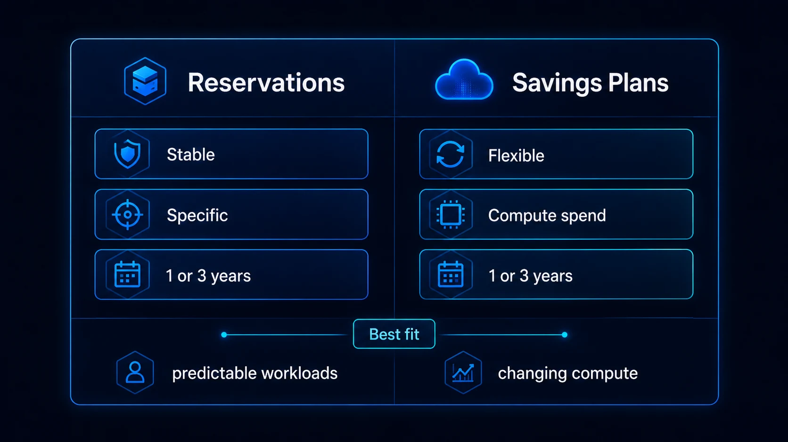

Una de las decisiones FinOps más importantes en Azure es determinar cuánto consumo estamos dispuestos a comprometer a cambio de un mejor precio.

Dos mecanismos relevantes son **Azure Reservations** y **Azure Savings Plans for Compute**.

Ambos pueden reducir el costo frente a Pay-As-You-Go, pero su lógica es distinta:

- **Reservation:** compromiso asociado a un tipo de recurso o familia, región y periodo.
- **Savings Plan:** compromiso de gasto por hora sobre servicios de cómputo elegibles.

La mejor decisión no es necesariamente escoger uno de los dos. En muchos ambientes ambos pueden complementarse.



## Antes de comprar cualquier compromiso

La optimización debe comenzar por el consumo.

Si una empresa tiene diez VMs sobredimensionadas y compra Reservations para esas diez VMs, obtiene un descuento sobre infraestructura que probablemente no necesitaba.

Una secuencia más saludable es:

```text
Visibilidad
→ eliminar desperdicio
→ rightsizing
→ estabilizar consumo
→ analizar compromisos
→ comprar
→ medir utilización
```

La pregunta correcta no es:

> ¿Cuánto descuento ofrece Azure?

Sino:

> ¿Qué parte del consumo seguirá existiendo con suficiente certeza durante el periodo del compromiso?

## Qué es Azure Reservations

Las Reservations permiten comprometer uso durante **uno o tres años** para determinados productos elegibles.

Microsoft indica que, según el servicio y configuración, las reservas pueden ofrecer descuentos significativos frente al precio Pay-As-You-Go. El porcentaje real depende del recurso y acuerdo comercial.

Una Reservation no apaga, bloquea ni modifica la VM. Es principalmente un **beneficio de facturación** que Azure intenta aplicar automáticamente al consumo que coincide.

Ejemplo simplificado:

```text
Necesidad estable:
D4s_v5
Mexico Central
24x7
3 años
```

Si el patrón es suficientemente predecible, una Reservation puede ser una candidata fuerte.

## Qué es Azure Savings Plan for Compute

Un Savings Plan funciona mediante un compromiso de **gasto por hora** durante uno o tres años.

Ejemplo:

```text
Compromiso: 10 USD/hora
Periodo: 3 años
```

Azure aplica el beneficio a consumo de cómputo elegible hasta cubrir ese compromiso.

La ventaja principal es la flexibilidad. Si los workloads cambian entre determinados servicios o regiones elegibles, el compromiso puede seguir encontrando consumo donde aplicarse.

## Diferencia conceptual

Imagina dos organizaciones.

### Empresa A

Tiene una plataforma SAP con 30 VMs que:

- operan 24/7;
- permanecen en la misma región;
- usan SKUs relativamente estables;
- tienen horizonte de varios años.

Tiene un patrón altamente predecible.

### Empresa B

Opera decenas de aplicaciones modernas:

- autoscaling;
- cambios frecuentes de SKU;
- varias regiones;
- VMs y otros servicios compute elegibles;
- modernización continua.

Su gasto puede ser estable aunque los recursos específicos cambien.

La Empresa A puede obtener gran valor de Reservations. La Empresa B puede valorar más la flexibilidad del Savings Plan.

## Comparación

| Criterio | Reservations | Savings Plans |
|---|---|---|
| Compromiso | Configuración/uso elegible | Gasto por hora |
| Duración | 1 o 3 años | 1 o 3 años |
| Flexibilidad | Menor | Mayor |
| Consumo altamente estable | Excelente candidato | También posible |
| Workloads cambiantes | Riesgo mayor | Mejor adaptación |
| Descuento potencial | Puede ser mayor en escenarios coincidentes | Flexible, descuento depende del uso |
| Requiere forecast | Sí | Sí |
| Riesgo de sobrecompromiso | Sí | Sí |

Un Savings Plan no elimina el riesgo. Si se comprometen 20 USD/h y sólo existen 12 USD/h de consumo elegible, la flexibilidad no corrige automáticamente el exceso.

## Utilización y cobertura

Dos métricas ayudan a evitar decisiones equivocadas.

### Utilización

Pregunta:

> ¿Qué porcentaje del compromiso comprado realmente se está utilizando?

Si compraste capacidad equivalente a 100 unidades y sólo 70 encuentran consumo, la utilización es baja.

### Cobertura

Pregunta:

> ¿Qué porcentaje de mi consumo elegible está recibiendo un beneficio de compromiso?

Una organización puede tener:

- utilización 100%;
- cobertura 50%.

Eso significa que todas sus compras están siendo utilizadas, pero todavía existe consumo Pay-As-You-Go que podría analizarse.

La meta no debería ser 100% de cobertura a cualquier costo. Mantener una parte de consumo flexible puede ser una decisión prudente.

## Nunca compres basado únicamente en el mes anterior

Un único mes puede estar distorsionado por:

- proyecto temporal;
- pruebas;
- migración;
- cierre fiscal;
- campaña;
- incidente;
- crecimiento excepcional;
- recursos que pronto serán retirados.

Utiliza una ventana representativa y conversa con los propietarios de los servicios.

El forecast financiero debe incorporar roadmap técnico.

## Rightsizing primero

Supongamos:

```text
VM actual: D8s_v5
Uso real: candidato a D4s_v5
```

Comprar una Reservation de D8s_v5 antes del rightsizing puede anclar la organización a una base de costo innecesaria.

Por eso la optimización de uso precede a la optimización de tarifa.

Revisa:

- CPU;
- memoria;
- IOPS;
- throughput;
- picos;
- HA;
- RTO/RPO;
- licenciamiento;
- batch windows.

Después estabiliza.

## Combinar Reservations y Savings Plans

No tienes que elegir una estrategia exclusiva.

Un modelo puede ser:

```text
Consumo base muy estable
        ↓
Reservations

Consumo estable pero cambiante
        ↓
Savings Plan

Consumo variable / incierto
        ↓
Pay-As-You-Go
```

Esto crea capas de compromiso.

Por ejemplo:

- 50% de la base altamente predecible → Reservations.
- 25% adicional con movilidad → Savings Plan.
- 25% variable → Pay-As-You-Go.

Los porcentajes son ilustrativos; cada organización necesita su propio análisis.

## Un proceso práctico de compra

### 1. Inventaría consumo elegible

Obtén datos desde Cost Management y Advisor.

### 2. Elimina anomalías

Excluye consumos que sabes que desaparecerán.

### 3. Haz rightsizing

No comprometas desperdicio.

### 4. Clasifica estabilidad

| Nivel | Descripción |
|---|---|
| Alta | 24/7, estable, roadmap conocido |
| Media | gasto estable pero recursos cambian |
| Baja | proyectos, dev/test, demanda variable |

### 5. Compara 1 vs 3 años

Tres años puede ofrecer mejores condiciones en determinados productos, pero aumenta el riesgo de cambio tecnológico.

### 6. Compra progresivamente

En vez de comprometer el 100% el primer día, puedes hacerlo por etapas.

```text
Mes 1: 30%
Mes 2: revisar
Mes 3: +20%
Mes 4: revisar
```

Esto reduce el riesgo de forecast incorrecto.

## ¿Qué pasa con Azure Hybrid Benefit?

Es otro mecanismo diferente.

Azure Hybrid Benefit puede permitir reutilizar determinadas licencias elegibles de Windows Server o SQL Server según sus términos.

En ciertos escenarios puede combinarse con mecanismos de compromiso.

Por eso un análisis FinOps no debería limitarse a Reservation vs Savings Plan.

También revisa:

- Hybrid Benefit;
- Dev/Test;
- precios contractuales;
- Spot;
- apagados;
- autoscaling;
- tiers;
- almacenamiento;
- arquitectura.

## Riesgo organizacional

Comprar un compromiso técnico sin ownership financiero es un error.

Cada compra debería tener:

- análisis;
- responsable;
- periodo;
- workloads considerados;
- monto;
- cobertura esperada;
- utilización objetivo;
- fecha de revisión;
- plan ante cambios.

Una Reservation de tres años no debería existir únicamente porque "Advisor la recomendó".

Advisor proporciona información para tomar una decisión; el negocio sigue siendo responsable del compromiso.

## Caso práctico

Supongamos que Cost Management muestra:

```text
Base de compute: 25 USD/h
Variación habitual: ±6 USD/h
```

Después del rightsizing:

```text
Base estable: 16 USD/h
Base flexible: 5 USD/h
Variable: 4 USD/h
```

Una estrategia posible sería:

```text
Reservations → porción altamente estable
Savings Plan → parte del gasto flexible elegible
PAYG → variación restante
```

La decisión final depende de SKUs, servicios, regiones, precios y horizonte.

## Errores frecuentes

### Buscar 100% de cobertura

Puede crear sobrecompromiso.

### Comprar tres años porque "ahorra más"

Un descuento mayor no compensa un compromiso que dejarás de usar.

### No considerar modernización

Si migrarás VMs hacia PaaS dentro de nueve meses, un compromiso largo requiere análisis adicional.

### Ignorar crecimiento

También puede existir subcompromiso. El modelo debe revisarse periódicamente.

### Confundir descuento con ahorro realizado

El ahorro sólo es real cuando se compara contra una línea base válida y el compromiso se utiliza correctamente.

## Matriz de decisión

| Situación | Preferencia inicial |
|---|---|
| VM estable 24/7 varios años | Reservation |
| Infraestructura regulada muy predecible | Reservation |
| Compute cambia entre servicios elegibles | Savings Plan |
| Workloads cambian de región | Savings Plan |
| Proyecto temporal | PAYG |
| Dev/Test irregular | PAYG / automatización |
| Carga interrumpible | Evaluar Spot |
| Base estable + crecimiento variable | Combinar |

"Preferencia inicial" no significa compra automática. Siempre valida precios y recomendaciones vigentes.

## Conclusión

Reservations y Savings Plans son herramientas financieras sobre una arquitectura técnica.

**Reservations** pueden ser ideales cuando conoces con precisión qué consumo persistirá.

**Savings Plans** ofrecen mayor flexibilidad cuando el gasto es estable pero los recursos pueden cambiar.

Una estrategia FinOps madura utiliza compromisos únicamente después de optimizar el uso y mantener una parte del consumo flexible para absorber incertidumbre.

El objetivo no es obtener el porcentaje de descuento más alto. Es reducir el **costo total esperado sin comprometer dinero que la organización no podrá utilizar**.

## Fuentes oficiales

- [Decide between a savings plan and a reservation](https://learn.microsoft.com/en-us/azure/cost-management-billing/savings-plan/decide-between-savings-plan-reservation)
- [What are Azure Reservations?](https://learn.microsoft.com/en-us/azure/cost-management-billing/reservations/save-compute-costs-reservations)
- [Azure savings plan overview](https://learn.microsoft.com/en-us/azure/cost-management-billing/savings-plan/savings-plan-overview)
- [Reservations and savings plan FAQ](https://learn.microsoft.com/en-us/azure/cost-management-billing/reservations-savings-plan-faq)
- [Microsoft Cost Management best practices](https://learn.microsoft.com/en-us/azure/cost-management-billing/costs/cost-mgt-best-practices)
