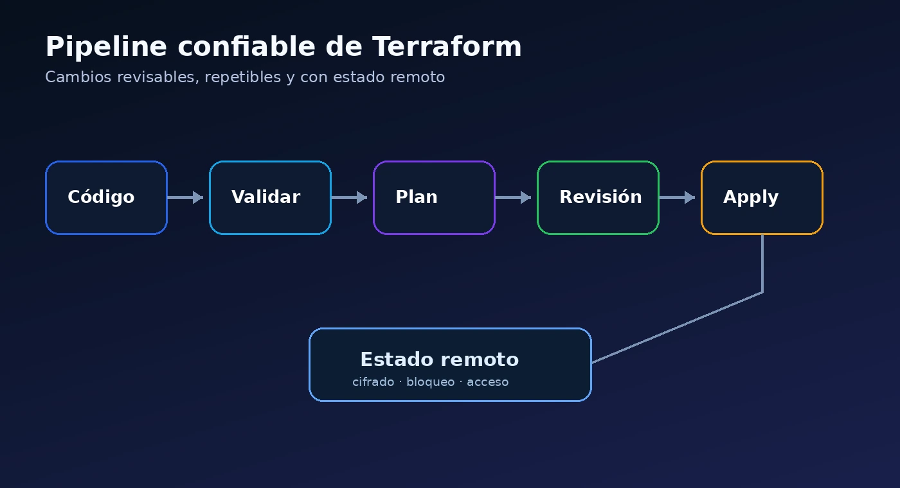

Terraform facilita la creación repetible de infraestructura, pero no elimina la necesidad de diseñar un proceso. Muchos incidentes no nacen del proveedor cloud, sino de estados mal administrados, cambios sin revisión o módulos con demasiadas responsabilidades.



## Usar estado local en trabajo colaborativo

El archivo de estado representa la relación entre el código y los recursos reales. Guardarlo únicamente en la computadora de una persona impide el bloqueo, dificulta la recuperación y aumenta la probabilidad de cambios simultáneos.

Para equipos, utiliza un backend remoto con control de acceso, cifrado y bloqueo cuando el backend lo soporte.

## Mezclar ambientes en el mismo estado

Producción, pruebas y desarrollo no deberían compartir un estado sin una razón explícita. Separarlos reduce el alcance de los cambios y facilita aplicar controles distintos.

| Riesgo | Práctica recomendada |
|---|---|
| Cambios accidentales en producción | Estados y pipelines separados por ambiente |
| Variables sensibles en el repositorio | Secretos desde un almacén seguro o el pipeline |
| Recursos sin propietario | Etiquetas obligatorias y validación previa |
| Módulos difíciles de actualizar | Interfaces pequeñas y versiones controladas |

## Crear módulos demasiado grandes

Un módulo que intenta desplegar red, identidad, monitoreo, seguridad y aplicaciones suele ser difícil de probar. Prefiere módulos que representen una capacidad coherente y tengan entradas y salidas explícitas.

```hcl
module "network" {
  source              = "./modules/network"
  resource_group_name = azurerm_resource_group.platform.name
  address_space       = ["10.20.0.0/16"]
}
```

## Aplicar sin revisar el plan

El pipeline debe ejecutar formato, validación, análisis de seguridad y `terraform plan`. La aplicación debería ocurrir únicamente después de una revisión, especialmente en ambientes productivos.

## Depender de permisos excesivos

La identidad de automatización necesita los permisos suficientes para su alcance, no privilegios globales permanentes. Divide responsabilidades cuando una sola identidad pueda modificar demasiadas capas de la plataforma.

## No definir una estrategia de versiones

Controla las versiones de Terraform, proveedores y módulos. Una actualización automática sin pruebas puede introducir cambios de comportamiento en el plan.

## Conclusión

La automatización confiable depende tanto del código como del proceso. Estado remoto, separación por ambiente, módulos claros, revisión del plan y privilegio mínimo forman una base que reduce fallas y facilita el crecimiento.
