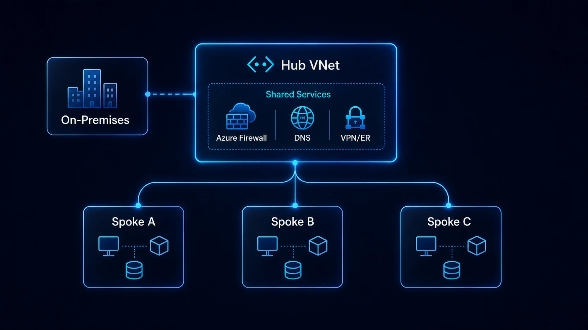

A medida que una organización incorpora workloads en Azure, conectar cada Virtual Network directamente con todas las demás puede convertirse rápidamente en un problema de escala, seguridad y operación.

El patrón **Hub & Spoke** organiza la red alrededor de una Virtual Network central —el hub— que concentra conectividad y determinados servicios compartidos. Los workloads se despliegan en redes independientes —los spokes— que se conectan al hub.

Microsoft utiliza este patrón como una de las topologías de referencia para Azure Landing Zones y es especialmente común en entornos híbridos.



## Qué problema resuelve Hub & Spoke

Supongamos que existen diez aplicaciones y cada una tiene su propia VNet.

Sin un patrón central, pueden aparecer:

- múltiples gateways;
- conexiones VPN duplicadas;
- reglas de seguridad inconsistentes;
- rutas difíciles de administrar;
- DNS distinto por aplicación;
- exposición directa a Internet;
- falta de inspección central;
- peerings entre todos los workloads.

Con Hub & Spoke se establece un punto central para capacidades transversales.

```text
               On-premises
                   │
          ExpressRoute / VPN
                   │
               [ HUB VNet ]
             /      |       \
        Spoke A   Spoke B   Spoke C
        ERP       Data      Web
```

El objetivo no es que todo el tráfico pase obligatoriamente por el hub, sino disponer de una arquitectura deliberada para los flujos que necesitan servicios centrales.

## Qué suele existir en el hub

Dependiendo de los requisitos, el hub puede alojar:

- Azure Firewall;
- ExpressRoute Gateway;
- VPN Gateway;
- Azure Bastion;
- DNS Private Resolver;
- servicios DNS;
- Network Virtual Appliances;
- determinados servicios de seguridad;
- conectividad hacia redes corporativas.

No todos estos componentes son obligatorios.

Un error habitual es construir un hub complejo simplemente porque el diagrama de referencia muestra varios servicios. El diseño debe partir de los flujos reales.

## Qué debe vivir en los spokes

Los spokes deberían representar límites claros de workload o responsabilidad.

Por ejemplo:

```text
vnet-spoke-sap-prod
vnet-spoke-ecommerce-prod
vnet-spoke-data-prod
vnet-spoke-dev
```

Dentro del spoke pueden existir:

- máquinas virtuales;
- AKS;
- Private Endpoints;
- Application Gateway;
- servicios integrados con VNet;
- componentes propios de la aplicación.

En modelos de landing zone, los spokes suelen residir en suscripciones de aplicación diferentes mientras el hub pertenece a una suscripción central de Connectivity.

Esto crea separación entre plataforma y workload.

## VNet Peering no es routing transitivo

Un punto crítico: **Virtual Network Peering no es transitivo por defecto**.

Si `Spoke-A` está conectado al hub y `Spoke-B` también está conectado al hub, eso no significa automáticamente que A pueda comunicarse con B utilizando el hub como router.

Para implementar tránsito se necesitan decisiones de routing, por ejemplo:

- Azure Firewall;
- NVA;
- Virtual WAN;
- Azure Route Server en determinados escenarios;
- rutas definidas por usuario.

Esta característica debe entenderse antes de diseñar tráfico spoke-to-spoke.

## Routing con UDR

Las **User Defined Routes (UDR)** permiten modificar el next hop del tráfico.

Un ejemplo frecuente es forzar que Internet salga mediante Azure Firewall:

```text
Spoke subnet
0.0.0.0/0
    ↓
Virtual appliance
    ↓
Azure Firewall private IP
```

Esto habilita control central de egress.

También pueden utilizarse UDR para controlar comunicación:

```text
Spoke → Hub
Spoke → On-premises
Spoke → Spoke
```

Pero las rutas deben analizarse de forma integral. Una UDR incorrecta puede causar routing asimétrico o pérdida de conectividad.

## Azure Firewall en el hub

Azure Firewall puede funcionar como punto central de control para:

- tráfico saliente a Internet;
- tráfico entre redes;
- tráfico híbrido;
- filtrado L3/L4;
- reglas de aplicación;
- DNAT;
- capacidades adicionales en Premium.

Sin embargo, Azure Firewall no sustituye automáticamente a NSG ni WAF. Cada servicio opera con un propósito diferente.

Un modelo común es:

```text
Internet
   │
Application Gateway + WAF
   │
Spoke Web
   │
Azure Firewall ─── On-premises
   │
Internet egress
```

El diseño exacto debe evitar hairpinning innecesario.

## ¿Application Gateway debe vivir en el hub?

No necesariamente.

Aunque puede centralizarse, muchas organizaciones prefieren que **Application Gateway sea propiedad del workload** porque:

- su lifecycle está ligado a la aplicación;
- sus reglas cambian con releases;
- los certificados pertenecen al servicio;
- el equipo de aplicación conoce el routing HTTP.

Microsoft señala que los equipos de aplicaciones frecuentemente administran componentes como Application Gateway o API Management y pueden desplegarlos dentro de los spokes.

Centralizar todo el Layer 7 en el hub puede crear un cuello de botella operativo.

## DNS: uno de los temas más subestimados

La red puede estar perfectamente conectada y aun así una aplicación fallar por DNS.

Esto es especialmente relevante al utilizar:

- Private Endpoints;
- redes híbridas;
- dominios on-premises;
- zonas Private DNS;
- PaaS privado.

El diseño debe responder:

- ¿quién resuelve nombres corporativos?
- ¿cómo se resuelven Private Endpoints?
- ¿cómo consulta Azure DNS on-premises?
- ¿cómo consulta on-premises zonas privadas de Azure?

Azure DNS Private Resolver permite construir resolución híbrida sin depender necesariamente de VMs DNS personalizadas.

## Hub & Spoke híbrido

Cuando existe datacenter, el hub suele convertirse en punto de entrada hacia Azure mediante:

- ExpressRoute;
- Site-to-Site VPN;
- ambos como diseños complementarios según continuidad.

Un patrón simplificado:

```text
Datacenter
    │
ExpressRoute
    │
Hub
├── Firewall
├── DNS
├── Gateway
└── Shared Services
    │
    ├── SAP Spoke
    ├── Data Spoke
    └── App Spoke
```

Esto evita desplegar un gateway para cada workload.

## ¿Un hub por región?

Frecuentemente sí cuando existen workloads en múltiples regiones, aunque depende de latencia, resiliencia y patrón de conectividad.

Ejemplo:

```text
Hub Mexico Central
├── Spoke A
└── Spoke B

Hub East US 2
├── Spoke DR-A
└── Spoke DR-B
```

Después debe definirse cómo se conectan los hubs.

Para arquitecturas globales con gran número de regiones y sucursales, Azure Virtual WAN puede resultar más apropiado que administrar manualmente una gran cantidad de peerings y rutas.

## Hub & Spoke vs Virtual WAN

No existe un ganador universal.

| Criterio | Hub & Spoke tradicional | Virtual WAN |
|---|---|---|
| Control detallado | Alto | Más administrado |
| Complejidad inicial | Moderada | Moderada |
| Muchas sucursales | Puede crecer rápidamente | Fuerte escenario |
| Routing global | Requiere diseño | Más integrado |
| Customización | Flexible | Más opinionado |
| Operación | Equipo administra más piezas | Azure administra más del fabric |

La decisión debería considerar el modelo operativo, no solamente la cantidad de VNets.

## Seguridad por capas

En una topología empresarial pueden coexistir:

**NSG**

Control local en subnet/NIC.

**Azure Firewall**

Control centralizado de tráfico.

**WAF**

Protección HTTP/S a nivel de aplicación.

**DDoS Protection**

Mitigación especializada de ataques volumétricos cuando el escenario lo requiere.

No se deben reemplazar unos por otros únicamente para simplificar el diagrama.

## Errores comunes

### Convertir el hub en una "mega red"

El hub debe contener capacidades compartidas, no todos los workloads.

### Crear peerings indiscriminados

Los peerings generan dependencias y deben responder a un flujo requerido.

### No documentar routing

Una tabla con prefijos, next hop, origen y destino puede evitar horas de troubleshooting.

### Centralizar Application Gateway sin necesidad

Centralizar L7 puede dificultar releases y ownership.

### Ignorar costos de tráfico

Peering, firewall, gateways y transferencia tienen costos. La arquitectura lógica debe evaluarse también desde FinOps.

### No diseñar DNS

Con Private Endpoints, DNS se convierte en parte crítica de la arquitectura.

### Forzar todo el tráfico por el firewall sin analizarlo

Inspección innecesaria puede incrementar costo y latencia y generar rutas complejas.

## Checklist de diseño

Antes de desplegar:

1. documenta todos los flujos;
2. define CIDR sin traslapes;
3. reserva capacidad de crecimiento;
4. establece ownership del hub;
5. decide dónde se ubica el firewall;
6. define estrategia DNS;
7. diseña routing;
8. valida tráfico spoke-to-spoke;
9. define conectividad híbrida;
10. analiza alta disponibilidad;
11. estima costos;
12. automatiza con IaC;
13. prueba escenarios de falla.

## Conclusión

Hub & Spoke sigue siendo un patrón muy relevante en Azure porque separa workloads mientras centraliza determinadas capacidades de red.

Su principal beneficio no es dibujar una VNet grande en el centro. Es establecer **responsabilidades y flujos previsibles**.

Una buena arquitectura Hub & Spoke permite que nuevos workloads se conecten utilizando patrones conocidos. Una mala implementación puede convertir el hub en un punto de congestión técnico y organizacional.

Diseña primero los flujos y responsabilidades. Después decide qué componentes deben centralizarse.

## Fuentes oficiales

- [Hub-spoke network topology in Azure](https://learn.microsoft.com/en-us/azure/architecture/networking/architecture/hub-spoke)
- [Azure Landing Zones](https://learn.microsoft.com/en-us/azure/cloud-adoption-framework/ready/landing-zone/)
- [Hub-spoke topology with Azure Virtual WAN](https://learn.microsoft.com/en-us/azure/architecture/networking/architecture/hub-spoke-virtual-wan-architecture)
- [Azure Firewall in multi-hub and spoke topologies](https://learn.microsoft.com/en-us/azure/firewall/firewall-multi-hub-spoke)
- [Azure DNS Private Resolver](https://learn.microsoft.com/en-us/azure/dns/dns-private-resolver-overview)
