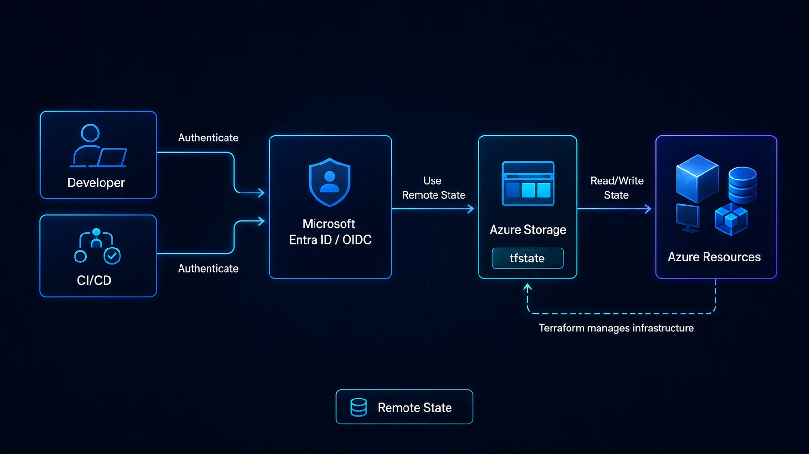

Terraform necesita conocer qué infraestructura administra. Esa relación se almacena en el **state**.

Cuando ejecutas Terraform localmente sin configurar un backend remoto, el estado puede permanecer en un archivo como:

```text
terraform.tfstate
```

Eso puede funcionar durante un laboratorio personal. En un equipo empresarial representa riesgos importantes:

- pérdida del archivo;
- múltiples copias;
- cambios concurrentes;
- exposición de información;
- ausencia de controles centralizados;
- dificultad para automatizar CI/CD.

Para Azure, una opción común es utilizar el backend **`azurerm`** y almacenar el state como un blob dentro de Azure Storage.



## Qué contiene Terraform State

El state mantiene información que permite relacionar configuración Terraform con recursos reales.

Simplificando:

```text
Código Terraform
      │
      ▼
Terraform State
      │
      ▼
Recursos Azure
```

Terraform lo utiliza para determinar:

- qué recursos administra;
- identificadores reales;
- dependencias;
- propiedades conocidas;
- cambios requeridos.

El state no debe tratarse como un archivo inofensivo.

Puede contener información sensible dependiendo de los recursos y providers utilizados.

Por eso no debería subirse a Git.

## Por qué usar Remote State

Con un backend remoto:

```text
Developer A ─┐
Developer B ─┼──→ Azure Storage ──→ terraform.tfstate
Pipeline CI ─┘
```

todos utilizan una ubicación controlada.

Los beneficios incluyen:

- colaboración;
- menor dependencia del disco local;
- control de acceso;
- versionamiento del blob;
- integración con pipelines;
- gobierno y auditoría.

## Arquitectura básica en Azure

Una implementación sencilla utiliza:

```text
Subscription Platform
└── Resource Group
    └── Storage Account
        └── Container: tfstate
            ├── networking-prod.tfstate
            ├── app-prod.tfstate
            └── app-nonprod.tfstate
```

No significa que todos los equipos deban compartir exactamente el mismo Storage Account.

La separación depende del modelo de seguridad.

## Configuración del backend azurerm

Una configuración básica puede verse así:

```hcl
terraform {
  backend "azurerm" {
    storage_account_name = "sttfstateprod001"
    container_name       = "tfstate"
    key                  = "networking-prod.tfstate"
    use_azuread_auth     = true
  }
}
```

Después:

```bash
terraform init
```

El backend se inicializa antes de que Terraform pueda utilizar el state remoto.

## No hardcodear secretos

Evita:

```hcl
access_key = "MI-STORAGE-ACCOUNT-KEY"
```

especialmente dentro del repositorio.

HashiCorp mantiene soporte para Access Keys por compatibilidad, pero su documentación actual recomienda mecanismos más seguros y señala OIDC como una alternativa preferible frente a administrar secretos.

## Microsoft Entra ID

El backend `azurerm` puede autenticarse contra el data plane de Azure Storage mediante Microsoft Entra ID.

Por ejemplo:

```hcl
terraform {
  backend "azurerm" {
    storage_account_name = "sttfstateprod001"
    container_name       = "tfstate"
    key                  = "platform.tfstate"
    use_azuread_auth     = true
  }
}
```

La identidad necesita permisos apropiados sobre el blob.

El principio debe ser el mismo que en cualquier otro componente cloud:

> otorga únicamente el acceso requerido al scope más pequeño posible.

HashiCorp documenta `Storage Blob Data Contributor` sobre el container como un rol recomendado para determinados métodos basados en Microsoft Entra ID.

## OIDC para pipelines

En CI/CD conviene evitar secretos de larga duración.

Con **OpenID Connect / workload identity federation**, la pipeline obtiene acceso utilizando una relación de confianza configurada con Microsoft Entra ID.

Arquitectura conceptual:

```text
GitHub Actions
     │
     │ OIDC token
     ▼
Microsoft Entra ID
     │
     ▼
Azure RBAC
     │
     ▼
Storage Account / Azure
```

Esto elimina la necesidad de mantener un client secret de larga duración en GitHub.

El backend `azurerm` soporta `use_oidc`.

## Separa state por blast radius

Un único state gigantesco puede convertirse en un problema.

Ejemplo a evitar:

```text
empresa-completa.tfstate

├── Landing Zone
├── Firewall
├── SAP
├── Data
├── AKS
├── Dev
└── Prod
```

Un cambio en una parte obliga a cargar y evaluar un state que representa una superficie enorme.

Una separación razonable puede basarse en:

- lifecycle;
- ownership;
- ambiente;
- privilegios;
- frecuencia de cambio;
- criticidad.

Ejemplo:

```text
platform-connectivity-prod.tfstate
platform-management-prod.tfstate
app-payments-prod.tfstate
app-payments-nonprod.tfstate
data-platform-prod.tfstate
```

## No fragmentes demasiado

El extremo contrario también es problemático.

Un state por recurso:

```text
vnet.tfstate
subnet1.tfstate
subnet2.tfstate
nsg1.tfstate
route1.tfstate
```

genera dependencias entre states y dificulta cambios atómicos.

La frontera adecuada generalmente corresponde a un conjunto de recursos que:

- cambian juntos;
- tienen mismo owner;
- comparten lifecycle;
- comparten nivel de privilegio.

## Prod y NonProd

Separar estados productivos y no productivos suele ser una decisión saludable.

```text
container/
├── app-prod.tfstate
└── app-nonprod.tfstate
```

En organizaciones con mayor segregación incluso pueden utilizarse:

- Storage Accounts distintos;
- subscriptions distintas;
- identidades distintas;
- pipelines distintas.

El objetivo es evitar que credenciales utilizadas por desarrollo tengan acceso innecesario al estado productivo.

## Protege el Storage Account

El state merece controles fuertes.

Considera:

### Azure RBAC

Evita permisos amplios al nivel de suscripción cuando el proceso sólo requiere acceso al container.

### Versioning

El versionamiento del blob puede ayudar a recuperar estados anteriores frente a cambios o eliminaciones accidentales.

### Soft delete

Evalúa habilitar capacidades de recuperación adecuadas para blobs.

### Networking

Según el modelo de ejecución, puedes restringir acceso de red al Storage Account.

Pero si utilizas runners hospedados públicamente, private endpoints requieren una estrategia de conectividad compatible.

### Logging

Registra operaciones relevantes y monitorea accesos inesperados.

### Locks

Un Resource Lock puede ayudar a reducir riesgo de eliminación accidental del Storage Account, aunque debe evaluarse con la operación prevista.

## ¿El state debe cifrarse?

Azure Storage cifra datos en reposo por defecto mediante sus mecanismos de plataforma.

Dependiendo de requisitos regulatorios puedes evaluar controles adicionales, como customer-managed keys.

Pero cifrado en reposo no sustituye:

- RBAC;
- networking;
- autenticación;
- manejo de secretos;
- segregación.

## Variables sensibles no significan state secreto

En Terraform:

```hcl
variable "password" {
  type      = string
  sensitive = true
}
```

`sensitive = true` ayuda a evitar que Terraform muestre ese valor en determinadas salidas, pero no significa automáticamente que el valor no pueda existir dentro del state.

Por eso debes proteger el state como información sensible.

## Backend y provider son autenticaciones diferentes

Otro concepto importante:

```text
Terraform backend
    ↓
acceso a Azure Storage

AzureRM provider
    ↓
administración de recursos Azure
```

Aunque ambos puedan utilizar la misma identidad, son responsabilidades diferentes.

Una pipeline necesita los permisos necesarios tanto para acceder al state como para modificar la infraestructura correspondiente.

## Bootstrap problem

Para almacenar state necesitas un Storage Account.

Pero si quieres desplegar todo con Terraform, surge la pregunta:

> ¿Dónde guarda Terraform el state del Storage Account que almacena el state?

Esto se conoce como un problema de bootstrap.

Opciones:

### Bootstrap manual controlado

Crear una única vez:

- resource group;
- storage account;
- container;
- permisos.

Después todo lo demás utiliza remote state.

### Bootstrap Terraform separado

Un pequeño proyecto Terraform puede desplegar el backend inicialmente con state local y después migrarlo.

Lo importante es documentar el proceso.

## Migrar de local a remote

Supongamos que ya tienes:

```text
terraform.tfstate
```

y agregas:

```hcl
terraform {
  backend "azurerm" {
    ...
  }
}
```

Al ejecutar:

```bash
terraform init
```

Terraform puede solicitar migrar el state al backend nuevo.

Antes:

1. respalda el state;
2. verifica que nadie esté ejecutando Terraform;
3. valida permisos;
4. realiza la migración;
5. ejecuta `terraform plan`;
6. confirma que no existan cambios inesperados.

No elimines el state local hasta confirmar la migración.

## Estructura recomendada

Un repositorio puede utilizar:

```text
terraform/
├── modules/
│   ├── network/
│   └── vm/
└── environments/
    ├── prod/
    │   ├── backend.hcl
    │   ├── main.tf
    │   └── variables.tf
    └── nonprod/
        ├── backend.hcl
        ├── main.tf
        └── variables.tf
```

Y parametrizar el backend:

```bash
terraform init \
  -backend-config="backend.hcl"
```

`backend.hcl` no debería contener secretos.

## Trabajo en equipo

El remote state resuelve parte de la colaboración, pero todavía necesitas una disciplina operacional.

Un patrón:

```text
feature branch
→ terraform fmt
→ validate
→ plan
→ Pull Request
→ aprobación
→ apply desde pipeline
```

Evita que múltiples ingenieros hagan `terraform apply` directamente desde laptops sobre producción.

La pipeline debería convertirse progresivamente en el punto controlado de cambio.

## Qué no almacenar en Git

Incluye reglas como:

```gitignore
.terraform/
*.tfstate
*.tfstate.*
crash.log
*.tfplan
```

No ignores automáticamente archivos `.terraform.lock.hcl`; normalmente conviene versionarlos para mantener selección consistente de providers.

## Checklist

Antes de considerar terminado el backend:

- [ ] State remoto configurado.
- [ ] Microsoft Entra ID u OIDC donde sea viable.
- [ ] Sin Access Keys dentro del repo.
- [ ] RBAC con mínimo privilegio.
- [ ] Prod separado de NonProd.
- [ ] Blob versioning evaluado/habilitado.
- [ ] Recuperación de blobs configurada según requisitos.
- [ ] Storage Account protegido.
- [ ] State excluido de Git.
- [ ] Pipeline controla producción.
- [ ] Proceso de recuperación documentado.
- [ ] Ownership definido.
- [ ] Backend probado desde una segunda sesión/pipeline.

## Conclusión

Terraform Remote State no es simplemente una mejora para trabajar en equipo. Es una decisión de arquitectura y seguridad.

En Azure, el backend `azurerm` permite utilizar Azure Storage como repositorio del state y soporta autenticación moderna con Microsoft Entra ID y OIDC.

Una implementación madura debería proteger el state como protegería otros datos operativos sensibles: mínimo privilegio, segregación, recuperación, logging y cambios controlados.

El objetivo final es que ningún despliegue productivo dependa del archivo `terraform.tfstate` que vive en la laptop de una persona.

## Fuentes oficiales

- [Terraform azurerm backend](https://developer.hashicorp.com/terraform/language/backend/azurerm)
- [Terraform backend configuration](https://developer.hashicorp.com/terraform/language/backend)
- [Terraform state](https://developer.hashicorp.com/terraform/language/state)
- [Microsoft Entra workload identity federation](https://learn.microsoft.com/en-us/entra/workload-id/workload-identity-federation)
- [Authorize access to blobs using Microsoft Entra ID](https://learn.microsoft.com/en-us/azure/storage/blobs/authorize-access-azure-active-directory)
