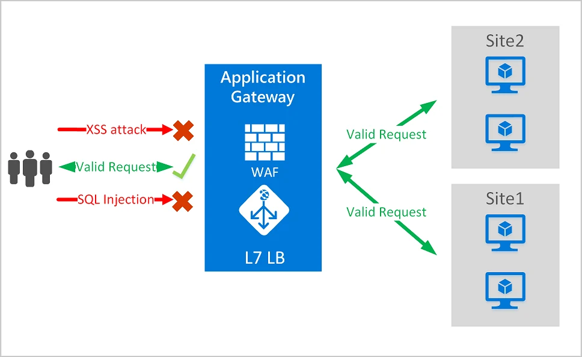

---

schemaVersion: 1
contentType: "guide"
title: "Publica y protege aplicaciones con Azure Application Gateway WAF v2"
description: "Despliega Azure Application Gateway WAF v2, configura backend pool, listener, health probe, routing y una WAF Policy para proteger aplicaciones web."
summary: "Guía práctica para configurar Application Gateway WAF v2 desde el portal, integrar un backend, revisar salud, asociar una WAF Policy y validar la publicación de una aplicación HTTP/S."
category: "Seguridad y Gobierno"
tags: ["Azure", "Application Gateway", "WAF", "WAF v2", "Networking", "Seguridad", "Load Balancing"]
publishedAt: "2026-08-10"
updatedAt: "2026-08-10"
author: "Irving Omar Patron Padron"
draft: false
featured: false
reviewStatus: "approved"
cover: "./microsoft-application-gateway-waf.webp"
coverAlt: "Diagrama oficial de Microsoft de Azure Application Gateway con Web Application Firewall bloqueando ataques web y enviando solicitudes válidas a backends"
imageCredit: "Microsoft Learn — Azure Web Application Firewall on Azure Application Gateway"
level: "Intermedio"
durationMinutes: 60
prerequisites: ["Suscripción activa de Azure", "Una VNet con espacio para subnet dedicada de Application Gateway", "Un backend HTTP o HTTPS accesible desde la VNet", "Permisos para crear Application Gateway, Public IP y WAF Policy"]
---

**Azure Application Gateway** es un balanceador de tráfico web de capa 7. Puede tomar decisiones de enrutamiento a partir de propiedades HTTP como host y path, terminar TLS y distribuir tráfico hacia uno o más backends.

Cuando utilizas **WAF v2**, agregas Web Application Firewall para proteger aplicaciones contra vulnerabilidades web comunes mediante reglas administradas y personalizadas.



*Imagen: Microsoft Learn, documentación oficial de Azure Web Application Firewall.*

## Objetivo

Al terminar tendrás un flujo similar:

```text
Internet
   │
   ▼
Public IP
   │
   ▼
Application Gateway WAF v2
   ├── Listener
   ├── WAF Policy
   ├── Routing Rule
   ├── Backend Settings
   └── Health Probe
            │
            ▼
         Backend
```

## Antes de desplegar: entiende las piezas

### Frontend

Dirección IP que recibe las solicitudes.

Puede ser pública o privada según el escenario.

### Listener

Espera solicitudes sobre una combinación de:

- IP frontend;
- puerto;
- protocolo;
- host name cuando aplica.

### Backend pool

Contiene destinos como:

- VMs;
- VM Scale Sets;
- IPs;
- FQDNs;
- App Service en configuraciones soportadas.

### Backend settings

Define cómo Application Gateway se conecta al backend:

- HTTP/HTTPS;
- puerto;
- timeout;
- host name;
- otras opciones.

### Routing rule

Conecta listener con backend pool y settings.

### Health probe

Comprueba si cada backend realmente puede atender solicitudes.

### WAF Policy

Contiene:

- managed rule sets;
- custom rules;
- exclusions;
- modo Detection/Prevention.

## Paso 1. Prepara la red

Application Gateway necesita una **subnet dedicada**.

Ejemplo:

```text
vnet-web
10.40.0.0/16

snet-appgw
10.40.0.0/24

snet-backend
10.40.10.0/24
```

Microsoft recomienda dimensionar adecuadamente la subnet de Application Gateway v2 y en su guía Well-Architected recomienda `/24` para soportar escalamiento y mantenimiento con margen.

No coloques VMs u otros workloads comunes dentro de `snet-appgw`.

## Paso 2. Crea Application Gateway

En Azure Portal:

**Create a resource → Application Gateway**

Configura:

```text
Tier: WAF V2
Virtual network: vnet-web
Subnet: snet-appgw
```

Para un escenario público:

```text
Frontend IP type: Public
```

Crea una Public IP Standard cuando el wizard lo solicite.

Para producción, evalúa:

- zone redundancy;
- autoscaling;
- capacidad mínima/máxima;
- arquitectura regional.

## Paso 3. Crea o asocia la WAF Policy

Puedes crear la política durante el despliegue o como recurso independiente.

En:

**Web Application Firewall policies → Create**

selecciona una política para:

```text
Application Gateway
```

Al crearla, utilizarás un managed ruleset de Microsoft.

### Detection vs Prevention

**Detection**

Registra coincidencias, pero no bloquea automáticamente de acuerdo con las reglas administradas.

Útil durante:

- onboarding;
- tuning;
- análisis de falsos positivos.

**Prevention**

Bloquea solicitudes que coinciden con reglas configuradas para bloquear.

Una estrategia empresarial frecuente es:

```text
Detection
→ revisar logs
→ ajustar exclusiones
→ Prevention
```

No mantengas indefinidamente WAF en Detection sólo para evitar analizar alertas.

## Paso 4. Configura el backend pool

En:

**Application Gateway → Backend pools**

agrega el destino.

Ejemplos:

```text
10.40.10.4
10.40.10.5
```

o un FQDN soportado.

Si utilizas App Service debes tratar correctamente el host header y TLS hacia el backend. No reutilices sin análisis una configuración diseñada para VMs.

## Paso 5. Configura Backend Settings

Define cómo el gateway se comunica con el backend.

Para laboratorio HTTP:

```text
Protocol: HTTP
Port: 80
```

Para producción, normalmente deberías evaluar HTTPS end-to-end:

```text
Client
 HTTPS
   │
App Gateway
 HTTPS
   │
Backend
```

No confundas terminación TLS con eliminación de cifrado interno.

## Paso 6. Crea un health probe personalizado

Aunque Application Gateway dispone de probes predeterminados, una aplicación empresarial debería exponer un endpoint de salud útil.

Por ejemplo:

```text
/health
```

El endpoint idealmente responde:

```text
HTTP 200
```

cuando la instancia puede atender tráfico.

Configura:

```text
Protocol: HTTP o HTTPS
Host: según backend
Path: /health
Interval: según requerimiento
Timeout: según aplicación
Unhealthy threshold: según tolerancia
```

Un probe mal diseñado puede marcar como healthy una aplicación funcionalmente rota o sacar del pool un backend que todavía está sano.

## Paso 7. Crea el listener

Para laboratorio:

```text
Protocol: HTTP
Port: 80
```

Para producción:

```text
Protocol: HTTPS
Port: 443
Certificate: certificado válido
```

Si hospedas varios sitios, puedes utilizar listeners con host names diferentes.

## Paso 8. Crea la routing rule

Una regla básica conecta:

```text
Listener
   ↓
Backend pool
   ↓
Backend settings
```

Para múltiples aplicaciones puedes utilizar:

- reglas básicas;
- path-based routing;
- multi-site listeners.

Ejemplo:

```text
/api/*  → API backend
/images/* → static backend
```

## Paso 9. Asocia la WAF Policy

La WAF Policy puede asociarse de manera global al Application Gateway y existen escenarios con asociaciones más específicas.

En una primera implementación utiliza una política global mientras entiendes el comportamiento de las reglas.

Después puedes evolucionar hacia políticas con necesidades distintas por sitio.

## Paso 10. Revisa Backend Health

Antes de probar desde Internet ve a:

**Application Gateway → Backend health**

Esperas:

```text
Healthy
```

Si aparece:

```text
Unhealthy
```

no empieces cambiando WAF.

Primero revisa:

1. DNS;
2. route;
3. NSG;
4. backend port;
5. host header;
6. TLS/certificate;
7. health probe.

Backend Health es una de las primeras herramientas de troubleshooting.

## Paso 11. Prueba la aplicación

Obtén la IP pública del gateway.

Prueba:

```bash
curl -I http://<public-ip>
```

o, si configuraste HTTPS:

```bash
curl -I https://app.example.com
```

Esperas un código válido de tu aplicación.

## Paso 12. Valida WAF

No ataques sistemas ajenos.

Para laboratorio utiliza una aplicación controlada y patrones de prueba documentados.

Revisa:

**WAF Policy → Managed rules**

y los logs configurados en Azure Monitor.

Tu objetivo es comprobar que:

```text
Solicitud normal → permitida
Solicitud que coincide con regla → detectada/bloqueada según modo
```

## Logging y observabilidad

Configura Diagnostic Settings para enviar logs y métricas al destino definido por tu organización.

Monitorea especialmente:

- backend health;
- 4xx/5xx;
- backend response status;
- response time;
- WAF logs;
- capacidad y autoscaling.

Sin observabilidad, WAF puede generar bloqueos difíciles de explicar.

## HTTPS y certificados

En producción considera:

```text
Client → HTTPS → Application Gateway → HTTPS → Backend
```

Gestiona:

- certificados frontend;
- confianza del certificado backend;
- nombres DNS;
- rotación;
- Key Vault cuando corresponda.

La guía de laboratorio puede empezar con HTTP, pero no debe confundirse con una recomendación productiva.

## Errores frecuentes

### Backend Unhealthy

Normalmente es conectividad, probe, host name, puerto o TLS; no necesariamente el gateway completo.

### Colocar Application Gateway en una subnet compartida

Utiliza subnet dedicada.

### Activar Prevention sin tuning

Puedes provocar falsos positivos en aplicaciones existentes.

### Permitir acceso directo al backend público

Si el backend también es públicamente accesible, usuarios podrían saltarse el WAF. Diseña la ruta para que el Application Gateway sea el punto de entrada esperado.

### No revisar costos

Application Gateway WAF v2 tiene costos de capacidad y procesamiento. El laboratorio debe eliminarse cuando termine.

## Buenas prácticas para producción

- utiliza WAF v2 para nuevos diseños que requieran WAF;
- configura health endpoints reales;
- considera zone redundancy;
- dimensiona correctamente la subnet;
- utiliza HTTPS;
- centraliza logs;
- aplica RBAC de mínimo privilegio;
- prueba cambios de WAF antes de bloquear producción;
- evita UDRs en la subnet de Application Gateway salvo escenarios soportados y comprendidos.

## Limpieza

Si todo pertenece al laboratorio:

```text
Resource Group → Delete
```

Si utilizaste un backend compartido, elimina únicamente:

- Application Gateway;
- Public IP temporal;
- WAF Policy creada para el lab;
- recursos de prueba.

## Fuentes oficiales

- [Quickstart: Direct web traffic with Application Gateway](https://learn.microsoft.com/en-us/azure/application-gateway/quick-create-portal)
- [Tutorial: Application Gateway with WAF](https://learn.microsoft.com/en-us/azure/web-application-firewall/ag/application-gateway-web-application-firewall-portal)
- [Create WAF policies for Application Gateway](https://learn.microsoft.com/en-us/azure/web-application-firewall/ag/create-waf-policy-ag)
- [Architecture best practices for Application Gateway v2](https://learn.microsoft.com/en-us/azure/well-architected/service-guides/azure-application-gateway)
