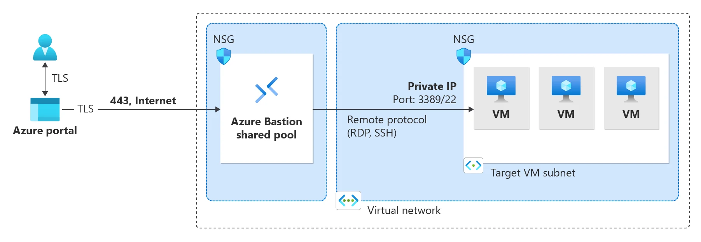

---

schemaVersion: 1
contentType: "guide"
title: "Administra VMs sin IP pública con Azure Bastion"
description: "Despliega Azure Bastion y accede de forma segura por RDP o SSH a máquinas virtuales mediante IP privada, sin exponer puertos de administración."
summary: "Laboratorio para implementar Azure Bastion, preparar la subnet requerida, conectar una VM sin IP pública, validar RDP/SSH y revisar decisiones de SKU, NSG y arquitectura."
category: "Seguridad y Gobierno"
tags: ["Azure", "Azure Bastion", "RDP", "SSH", "Virtual Machines", "Networking", "Seguridad"]
publishedAt: "2026-08-10"
updatedAt: "2026-08-10"
author: "Irving Omar Patron Padron"
draft: false
featured: false
reviewStatus: "approved"
cover: "./microsoft-azure-bastion.webp"
coverAlt: "Arquitectura oficial de Microsoft para Azure Bastion mostrando acceso administrado a máquinas virtuales mediante red privada"
imageCredit: "Microsoft Learn — What is Azure Bastion?"
level: "Inicial"
durationMinutes: 40
prerequisites: ["Suscripción activa de Azure", "Una Virtual Network", "Una VM Windows o Linux sin necesidad de IP pública", "Permisos para desplegar Azure Bastion y modificar la red"]
---

Exponer RDP o SSH directamente a Internet no debería ser el patrón predeterminado para administrar máquinas virtuales en Azure.

**Azure Bastion** proporciona conectividad administrada por RDP y SSH hacia VMs utilizando sus direcciones privadas. El usuario puede iniciar la sesión desde Azure Portal y, dependiendo del SKU, también mediante clientes nativos.

En este laboratorio desplegarás Bastion, conectarás una VM sin IP pública y comprobarás que la administración funciona sin publicar los puertos 3389 o 22 hacia Internet.



*Imagen: Microsoft Learn, documentación oficial de Azure Bastion.*

## Objetivo

Al terminar tendrás:

```text
Administrador
     │
 HTTPS / TLS
     │
     ▼
Azure Bastion
     │
 IP privada
     │
     ▼
VM
sin IP pública
```

La VM no necesitará:

```text
Public IP
```

ni una regla inbound de Internet hacia:

```text
3389
22
```

## Paso 1. Prepara la VNet

Para un despliegue dedicado de Bastion utiliza una subnet con el nombre requerido:

```text
AzureBastionSubnet
```

Ejemplo:

```text
vnet-management
10.70.0.0/16

AzureBastionSubnet
10.70.0.0/26

snet-workload
10.70.10.0/24
```

Antes de desplegar valida el tamaño mínimo soportado para el SKU y la arquitectura elegida en la documentación vigente.

No coloques workloads comunes dentro de `AzureBastionSubnet`.

## Paso 2. Prepara la VM de prueba

Despliega una VM en:

```text
snet-workload
```

Para este laboratorio:

```text
Public IP: None
```

Mantén el método de autenticación apropiado:

**Windows**

- usuario/contraseña;
- Microsoft Entra ID si tu diseño lo contempla.

**Linux**

- SSH key;
- usuario/contraseña si está permitido por tu política.

No crees una IP pública sólo para comprobar que la VM funciona. Bastion existe precisamente para evitar ese requisito en este flujo.

## Paso 3. Selecciona la estrategia de Bastion

Azure Bastion dispone de diferentes SKUs y arquitecturas.

La elección depende de necesidades como:

- laboratorio vs producción;
- clientes nativos;
- escalamiento;
- session recording;
- despliegue private-only;
- conectividad a redes emparejadas.

Para una prueba sencilla puedes revisar la disponibilidad de **Developer** en tu región.

Para un despliegue empresarial suelen evaluarse Basic, Standard o Premium según funciones requeridas.

No selecciones SKU únicamente por precio; primero documenta capacidades necesarias.

## Paso 4. Despliega Azure Bastion

Ve a:

**Azure Portal → Bastions → Create**

Configura:

```text
Name: bas-management
Virtual network: vnet-management
Subnet: AzureBastionSubnet
```

Según el SKU elegido, el wizard solicitará configuraciones adicionales.

Para SKUs dedicados que lo requieran, crea la Public IP compatible solicitada por el servicio.

> La existencia de una Public IP en el recurso Bastion no significa que tu VM tenga que tener una Public IP.

## Paso 5. Verifica que la VM no esté expuesta

Abre la VM:

**Networking**

Comprueba:

```text
Public IP address: None
```

y revisa el NSG.

Evita reglas como:

```text
Source: Internet
Destination port: 3389
Action: Allow
```

o:

```text
Source: Internet
Destination port: 22
Action: Allow
```

para el propósito de este laboratorio.

## Paso 6. Conecta mediante Bastion

En la VM:

**Connect → Bastion**

Selecciona el método de autenticación.

Para Windows, utiliza las credenciales correspondientes.

Para Linux, puedes usar la llave privada en un escenario controlado cuando el método y SKU lo soporten.

Pulsa:

```text
Connect
```

La sesión se abrirá sin que hayas asignado una dirección pública a la VM.

## Paso 7. Valida la ruta de administración

Dentro de la sesión:

**Windows**

```powershell
hostname
ipconfig
```

**Linux**

```bash
hostname
ip addr
```

Confirma que estás conectado a la dirección privada esperada.

También puedes revisar:

```text
VM → Networking → Network interface
```

para validar su IP.

## NSG y Azure Bastion

Bastion no elimina la necesidad de diseñar NSG.

Si aplicas reglas personalizadas a `AzureBastionSubnet`, debes respetar los flujos requeridos por el servicio.

Una política excesivamente restrictiva puede romper:

- control plane;
- GatewayManager;
- AzureLoadBalancer;
- conectividad hacia las VMs.

No copies una colección de reglas de Internet sin validar el SKU y la arquitectura que estás usando.

## Acceso a VNets emparejadas

Una ventaja de Bastion es que un despliegue puede servir para VMs de redes emparejadas en escenarios soportados.

Por ejemplo:

```text
Management VNet
    │
Azure Bastion
    │
    ├── Peering → App VNet
    └── Peering → Data VNet
```

Esto puede evitar desplegar un Bastion en cada spoke.

Debes validar:

- peering;
- routing;
- NSG;
- SKU;
- permisos.

## Private-only deployment

Azure Bastion Premium ofrece un escenario **private-only** en el que el Bastion no necesita una IP pública.

Este patrón puede ser relevante cuando una organización exige que la administración también se consuma únicamente desde redes privadas.

No confundas:

```text
VM sin IP pública
```

con:

```text
Bastion private-only
```

Son decisiones diferentes.

## Native client

Dependiendo del SKU puedes utilizar clientes SSH o RDP nativos.

Esto resulta útil para:

- port forwarding;
- workflows de administración;
- herramientas locales;
- sesiones que no quieres ejecutar dentro del navegador.

Si tu único requisito es acceso ocasional desde Portal, quizá no necesites todas esas capacidades.

## Session recording

Premium incorpora capacidades adicionales como session recording.

Para entornos regulados puede ayudar con:

- auditoría;
- cumplimiento;
- revisión de sesiones administrativas.

Pero la existencia de grabación no sustituye:

- RBAC;
- PIM;
- logging;
- segregación de responsabilidades.

## Checklist

- [ ] VM sin Public IP.
- [ ] No existe regla Internet → 22/3389.
- [ ] `AzureBastionSubnet` creada correctamente.
- [ ] Bastion desplegado.
- [ ] Conexión RDP/SSH exitosa.
- [ ] NSG revisado.
- [ ] SKU documentado.
- [ ] Acceso a VNets emparejadas probado si aplica.
- [ ] Logging y auditoría considerados.

## Troubleshooting

### La opción Bastion aparece pero la conexión falla

Revisa:

1. credenciales;
2. NSG;
3. IP privada;
4. estado de la VM;
5. protocolos RDP/SSH dentro del sistema operativo.

### Funciona en la VNet local pero no en un spoke

Comprueba:

- VNet Peering;
- NSG;
- rutas;
- soporte del SKU;
- resolución DNS si utilizas nombres.

### La VM todavía tiene una Public IP

Bastion seguirá pudiendo conectar, pero no estarías validando el objetivo del laboratorio.

Retira la Public IP de manera controlada antes de considerar terminado el ejercicio.

## Costos

Azure Bastion dedicado genera costos mientras permanece desplegado.

En laboratorios:

- registra la hora de creación;
- elimina Bastion al finalizar;
- revisa Cost Management.

No dejes un recurso de laboratorio ejecutándose sólo porque la VM está apagada.

## Limpieza

Si el resource group es exclusivo del laboratorio, elimínalo completo.

Si la red es compartida, elimina únicamente:

- Bastion;
- Public IP del Bastion si aplica;
- VM temporal;
- recursos de prueba.

No elimines `AzureBastionSubnet` si otro despliegue depende de ella.

## Fuentes oficiales

- [What is Azure Bastion?](https://learn.microsoft.com/en-us/azure/bastion/bastion-overview)
- [Azure Bastion design and architecture](https://learn.microsoft.com/en-us/azure/bastion/design-architecture)
- [Create an Azure Bastion deployment](https://learn.microsoft.com/en-us/azure/bastion/tutorial-create-host-portal)
- [Azure Bastion NSG guidance](https://learn.microsoft.com/en-us/azure/bastion/bastion-nsg)
