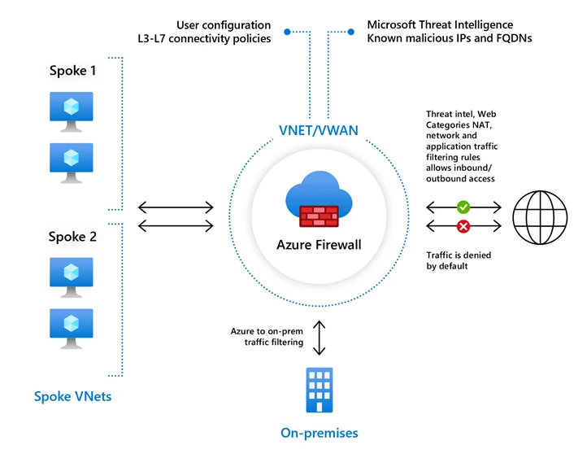

---

schemaVersion: 1
contentType: "guide"
title: "Controla el tráfico saliente con Azure Firewall y rutas UDR"
description: "Despliega Azure Firewall, crea una ruta UDR hacia su IP privada, asóciala al workload y valida que el tráfico saliente pase por el firewall."
summary: "Laboratorio para implementar Azure Firewall con Firewall Policy, crear una ruta 0.0.0.0/0 hacia el firewall, asociar la route table a una subnet de workloads y comprobar el flujo de salida."
category: "Seguridad y Gobierno"
tags: ["Azure", "Azure Firewall", "UDR", "Route Table", "Networking", "Seguridad", "Firewall Policy"]
publishedAt: "2026-08-10"
updatedAt: "2026-08-10"
author: "Irving Omar Patron Padron"
draft: false
featured: false
reviewStatus: "approved"
cover: "./microsoft-azure-firewall.webp"
coverAlt: "Diagrama oficial de Microsoft de Azure Firewall Standard inspeccionando tráfico entre spokes, Internet y redes on-premises"
imageCredit: "Microsoft Learn — Azure Firewall overview"
level: "Intermedio"
durationMinutes: 60
prerequisites: ["Suscripción activa de Azure", "Permisos para crear Azure Firewall, Public IP y Route Tables", "Conocimientos básicos de VNets, subnets y routing", "Una VM o workload de prueba"]
---

Desplegar Azure Firewall no significa automáticamente que los workloads comiencen a utilizarlo.

Para que una subnet envíe tráfico hacia el firewall necesitas diseñar el **routing**. Una técnica habitual consiste en crear una **User Defined Route (UDR)** con destino `0.0.0.0/0` y establecer como siguiente salto la IP privada de Azure Firewall.



*Imagen: Microsoft Learn, documentación oficial de Azure Firewall.*

## Objetivo

Construiremos:

```text
Workload subnet
      │
      │ UDR 0.0.0.0/0
      ▼
Azure Firewall private IP
      │
      ▼
Internet
```

y configuraremos una Firewall Policy para permitir únicamente el tráfico definido para el laboratorio.

## Arquitectura

Ejemplo:

```text
vnet-sec
10.50.0.0/16

AzureFirewallSubnet
10.50.0.0/26

snet-workload
10.50.10.0/24
```

> `AzureFirewallSubnet` es un nombre reservado y debe respetarse para el despliegue tradicional de Azure Firewall en una VNet.

Microsoft indica un tamaño `/26` para AzureFirewallSubnet en sus tutoriales actuales.

## Paso 1. Crea la VNet

Crea:

```text
vnet-sec
10.50.0.0/16
```

Subnets:

```text
AzureFirewallSubnet
10.50.0.0/26

snet-workload
10.50.10.0/24
```

Despliega tu workload de prueba en:

```text
snet-workload
```

Evita una IP pública en la VM para comprobar que el egress depende de la arquitectura definida.

## Paso 2. Crea Azure Firewall

Ve a:

**Firewalls → Create**

Selecciona el SKU apropiado para laboratorio.

Azure Firewall dispone actualmente de:

- Basic;
- Standard;
- Premium.

No elijas Premium únicamente porque tenga más funciones. La selección debe responder a throughput, inspección, IDPS/TLS y requisitos de seguridad.

## Paso 3. Utiliza Firewall Policy

La documentación actual de Microsoft recomienda **Firewall Policy** como método preferido frente al modelo clásico de reglas para nuevas configuraciones.

Crea:

```text
fw-policy-lab
```

y asóciala al firewall.

## Paso 4. Obtén la IP privada del firewall

Después del despliegue:

**Azure Firewall → Overview / IP configuration**

Anota:

```text
Firewall private IP
```

Ejemplo:

```text
10.50.0.4
```

Esa IP será el next hop de la UDR.

No utilices aquí la IP pública del firewall.

## Paso 5. Crea la Route Table

Ve a:

**Route tables → Create**

Nombre:

```text
rt-workload-egress
```

Agrega una ruta:

```text
Route name: default-to-firewall
Address prefix: 0.0.0.0/0
Next hop type: Virtual appliance
Next hop address: 10.50.0.4
```

Este patrón sobrescribe la ruta de sistema para Internet desde la subnet asociada.

## Paso 6. Asocia la route table

En:

**Route table → Subnets → Associate**

selecciona:

```text
vnet-sec
snet-workload
```

No asocies esta misma ruta indiscriminadamente a `AzureFirewallSubnet`.

Las rutas de la propia subnet del firewall requieren un análisis diferente y Azure Firewall necesita conectividad adecuada para operar.

## Paso 7. Crea una Application Rule

En Firewall Policy:

**Application rules → Add rule collection**

Para laboratorio puedes permitir un destino controlado, por ejemplo:

```text
Name: allow-microsoft
Protocol: HTTPS
Destination: www.microsoft.com
```

Define como origen el CIDR del workload:

```text
10.50.10.0/24
```

Esto demuestra que el firewall puede controlar egress a nivel de aplicación.

## Paso 8. Configura una Network Rule si la necesitas

Las Network Rules trabajan a nivel de:

- origen;
- destino;
- protocolo;
- puerto.

Ejemplo conceptual:

```text
Source: 10.50.10.0/24
Protocol: UDP
Destination: servidor DNS autorizado
Port: 53
```

No abras DNS hacia `Any` si la arquitectura utiliza un resolver corporativo específico.

## Paso 9. Comprueba la ruta efectiva

En la NIC de la VM:

**Effective routes**

Busca:

```text
0.0.0.0/0
Next hop: Virtual appliance
```

y confirma que el next hop corresponde a Azure Firewall.

También puedes usar Network Watcher:

**Next hop**

para comprobar qué dispositivo procesará un destino.

## Paso 10. Prueba tráfico permitido

Desde la VM:

```bash
curl -I https://www.microsoft.com
```

Si la regla permite el FQDN y DNS funciona, debes obtener respuesta.

## Paso 11. Prueba tráfico no permitido

Prueba un destino que no esté incluido en tu policy de laboratorio.

El comportamiento esperado es que Azure Firewall lo bloquee.

No necesitas usar sitios maliciosos para demostrar el control.

La prueba válida es:

```text
destino permitido → funciona
destino no permitido → bloqueado
```

## Paso 12. Revisa los logs

Configura Diagnostic Settings según tu estrategia.

Los logs permiten responder:

- qué origen inició el tráfico;
- qué regla coincidió;
- qué destino se solicitó;
- si se permitió o bloqueó.

Durante troubleshooting, el firewall no debería ser una caja negra.

## ¿Por qué 0.0.0.0/0?

La ruta:

```text
0.0.0.0/0
```

representa el destino por defecto cuando no existe un prefijo más específico.

Pero recuerda la regla fundamental de routing:

> **la ruta más específica gana.**

Si existe una ruta más específica hacia on-premises u otro destino, puede tener prioridad sobre el default route.

Esto es particularmente importante en Hub & Spoke con ExpressRoute o VPN.

## Routing asimétrico

Evita diseños en los que:

```text
ida → Firewall
retorno → otra ruta
```

Los firewalls stateful necesitan observar correctamente el flujo de la conexión.

Cuando insertas un firewall en una arquitectura existente debes analizar ambos sentidos.

## Azure Firewall y Hub & Spoke

Un diseño frecuente:

```text
Spoke A ─┐
Spoke B ─┼─→ Azure Firewall → Internet
Spoke C ─┘
             │
          On-premises
```

Las route tables de los spokes pueden dirigir tráfico al firewall.

Sin embargo, spoke-to-spoke y on-premises requieren analizar:

- peering;
- forwarded traffic;
- gateway transit;
- prefijos específicos;
- route propagation;
- UDRs.

No reduzcas todo Hub & Spoke a una única `0.0.0.0/0`.

## SNAT y alto volumen

Microsoft recomienda analizar **Azure NAT Gateway** para escenarios de gran volumen de tráfico saliente y presión de SNAT ports.

El diseño depende del SKU, arquitectura y patrones de conexión.

Esto es un tema de capacidad, no una razón para agregar NAT Gateway automáticamente en cada firewall.

## Errores frecuentes

### Crear el firewall pero olvidar la UDR

El tráfico de los workloads puede continuar utilizando rutas predeterminadas y no pasar por el firewall.

### Next hop con IP pública

La UDR hacia `Virtual appliance` utiliza la IP privada del firewall.

### Asociar la ruta a la subnet equivocada

Verifica qué subnet contiene realmente los workloads.

### Allow Any/Any para “hacerlo funcionar”

Puede ocultar el problema y dejar una policy insegura.

### No revisar Effective Routes

Antes de culpar al firewall, comprueba qué ruta eligió Azure.

## Checklist

- [ ] AzureFirewallSubnet correcta.
- [ ] Firewall Policy asociada.
- [ ] IP privada del firewall documentada.
- [ ] UDR `0.0.0.0/0` creada.
- [ ] Next hop `Virtual appliance`.
- [ ] Route table asociada a workload subnet.
- [ ] Effective routes verificadas.
- [ ] Regla permitida comprobada.
- [ ] Destino no permitido bloqueado.
- [ ] Logs disponibles.

## Limpieza

Azure Firewall puede generar costos relevantes incluso en un laboratorio.

Cuando termines:

1. elimina el resource group si está dedicado;
2. confirma que se eliminaron firewall y Public IP;
3. elimina VMs temporales;
4. revisa Cost Management posteriormente.

## Fuentes oficiales

- [Azure Firewall overview](https://learn.microsoft.com/en-us/azure/firewall/overview)
- [Deploy and configure Azure Firewall using the Azure portal](https://learn.microsoft.com/en-us/azure/firewall/tutorial-firewall-deploy-portal)
- [Azure virtual network traffic routing](https://learn.microsoft.com/en-us/azure/virtual-network/virtual-networks-udr-overview)
- [Route network traffic with a route table](https://learn.microsoft.com/en-us/azure/virtual-network/tutorial-create-route-table)
