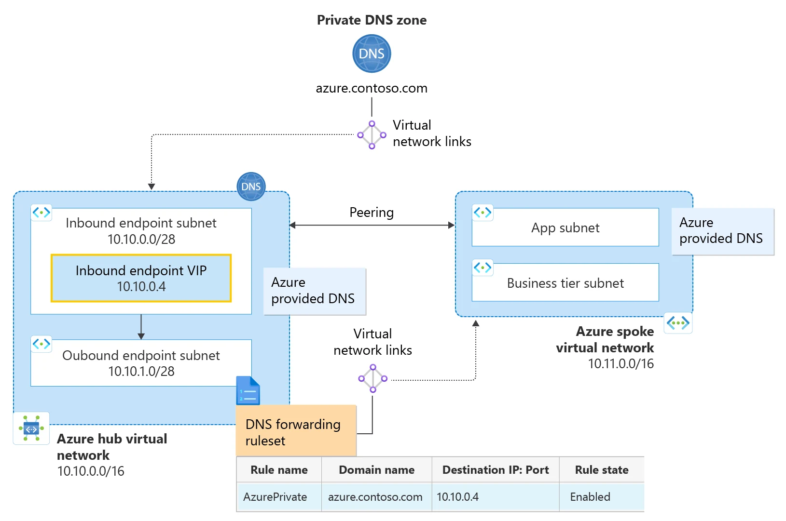

---

schemaVersion: 1
contentType: "guide"
title: "Resuelve DNS híbrido con Azure DNS Private Resolver"
description: "Configura Azure DNS Private Resolver con endpoints inbound y outbound, forwarding rules y una topología Hub & Spoke para resolución DNS híbrida."
summary: "Laboratorio para desplegar Azure DNS Private Resolver, crear endpoints, configurar un forwarding ruleset y entender la resolución entre Azure Private DNS, spokes y redes on-premises."
category: "Arquitectura Cloud"
tags: ["Azure", "DNS Private Resolver", "Private DNS", "Hub and Spoke", "Networking", "DNS", "Hybrid Cloud"]
publishedAt: "2026-08-10"
updatedAt: "2026-08-10"
author: "Irving Omar Patron Padron"
draft: false
featured: false
reviewStatus: "approved"
cover: "./microsoft-dns-private-resolver.webp"
coverAlt: "Arquitectura oficial de Microsoft de Azure DNS Private Resolver en una topología Hub and Spoke con endpoints y forwarding rules"
imageCredit: "Microsoft Learn — Azure DNS Private Resolver architecture guidance"
level: "Intermedio"
durationMinutes: 60
prerequisites: ["Suscripción activa de Azure", "Una VNet Hub y al menos una VNet Spoke", "VNet Peering configurado", "Conocimientos básicos de DNS y Azure Private DNS Zones"]
---

Cuando una arquitectura utiliza **Private Endpoints**, redes híbridas y múltiples VNets, DNS deja de ser un detalle y se convierte en una pieza central del diseño.

**Azure DNS Private Resolver** permite resolver nombres entre Azure y entornos privados sin tener que mantener máquinas virtuales DNS personalizadas únicamente para forwarding.

En esta guía desplegarás un resolver en el hub y configurarás los componentes necesarios para resolver namespaces privados.



*Imagen: Microsoft Learn, arquitectura oficial de DNS Private Resolver.*

## Objetivo

El laboratorio seguirá este patrón:

```text
On-premises
     │
     │ DNS
     ▼
Inbound endpoint
     │
Azure DNS Private Resolver
     │
Outbound endpoint
     │
Forwarding ruleset
     │
     ▼
DNS destino / namespace privado
```

y dentro de Azure:

```text
Spoke
  │
  └── DNS forwarding ruleset
          │
          ▼
       Resolver
```

## Componentes

### Inbound endpoint

Recibe consultas DNS hacia Azure.

Es útil cuando clientes on-premises necesitan resolver:

- Private DNS Zones;
- nombres hospedados mediante Azure DNS;
- namespaces privados accesibles desde el resolver.

### Outbound endpoint

Permite enviar consultas desde Azure hacia servidores DNS externos.

Ejemplo:

```text
corp.contoso.com
     ↓
10.1.0.10
```

### DNS forwarding ruleset

Define:

```text
dominio → servidor DNS destino
```

y puede vincularse a VNets.

## Paso 1. Prepara la red

Ejemplo:

```text
vnet-hub
10.80.0.0/16

snet-dns-inbound
10.80.10.0/28

snet-dns-outbound
10.80.20.0/28
```

Y un spoke:

```text
vnet-app
10.81.0.0/16
```

con peering:

```text
vnet-hub ↔ vnet-app
```

Las subnets de endpoints deben dedicarse al propósito correspondiente de acuerdo con los requisitos del servicio.

## Paso 2. Crea Azure DNS Private Resolver

Ve a:

**DNS Private Resolvers → Create**

Configura:

```text
Name: dnspr-hub
Virtual network: vnet-hub
```

La ubicación debe ser compatible con la VNet seleccionada.

## Paso 3. Crea el inbound endpoint

Dentro del resolver:

**Inbound endpoints → Add**

Selecciona:

```text
snet-dns-inbound
```

Puedes utilizar asignación dinámica o una dirección compatible con la configuración disponible.

Después del despliegue obtendrás una IP privada, por ejemplo:

```text
10.80.10.4
```

Ésta es la dirección hacia la que un DNS on-premises podría reenviar consultas destinadas a Azure.

## Paso 4. Crea el outbound endpoint

En:

**Outbound endpoints → Add**

Selecciona:

```text
snet-dns-outbound
```

El outbound endpoint será utilizado por forwarding rulesets para enviar consultas a DNS externos.

No confundas su función con la del inbound endpoint.

## Paso 5. Crea un forwarding ruleset

Crea:

```text
dnsfrs-hub
```

Asócialo al outbound endpoint.

Después agrega una forwarding rule.

Ejemplo:

```text
Domain: corp.contoso.com.
Destination:
10.1.0.10:53
```

En DNS, el punto final del dominio puede ser significativo en ciertas herramientas; valida la sintaxis del portal o API que utilices.

## Paso 6. Vincula el ruleset al spoke

Dentro del forwarding ruleset:

**Virtual network links → Add**

Selecciona:

```text
vnet-app
```

Ahora los recursos del spoke que utilicen Azure-provided DNS pueden beneficiarse de las reglas de forwarding vinculadas, según la arquitectura.

## Paso 7. Configura una Private DNS Zone

Crea una zona de ejemplo:

```text
azure.contoso.com
```

Agrega:

```text
app.azure.contoso.com
A
10.81.10.4
```

Vincula la zona con la VNet correspondiente.

El objetivo es demostrar que Azure-provided DNS puede resolver las zonas privadas vinculadas.

## Paso 8. Prueba resolución desde el spoke

Desde una VM de prueba:

```bash
nslookup app.azure.contoso.com
```

Debe resolver:

```text
10.81.10.4
```

Después prueba un namespace reenviado:

```bash
nslookup server.corp.contoso.com
```

Si la forwarding rule y conectividad al DNS destino son correctas, obtendrás la respuesta proporcionada por ese servidor.

## Paso 9. Prueba inbound desde on-premises

En el DNS corporativo crea un conditional forwarder para el namespace que Azure debe resolver.

Ejemplo conceptual:

```text
azure.contoso.com
    ↓
10.80.10.4
```

La IP corresponde al inbound endpoint.

Una consulta desde on-premises:

```text
app.azure.contoso.com
```

debería llegar al resolver y resolverse mediante Azure DNS.

Este paso requiere conectividad privada como VPN o ExpressRoute entre ambas redes.

## Private Endpoints y DNS

Uno de los usos más importantes es resolver zonas como:

```text
privatelink.blob.core.windows.net
privatelink.vaultcore.azure.net
```

En una arquitectura centralizada puedes:

- hospedar Private DNS Zones de forma central;
- vincular VNets necesarias;
- utilizar DNS Private Resolver para consultas híbridas.

Pero no existe una única topología universal.

Microsoft documenta modelos:

- distribuidos;
- centralizados.

Selecciona según ownership, cantidad de VNets y dependencia híbrida.

## No configures 168.63.129.16 en on-premises

La IP especial de Azure DNS:

```text
168.63.129.16
```

está disponible desde Azure bajo condiciones específicas.

No es un servidor DNS al que tu datacenter pueda enviar consultas directamente a través de ExpressRoute como si fuera una IP corporativa normal.

Para ese escenario utiliza el **inbound endpoint**.

## Troubleshooting por capas

Cuando DNS falla, valida en este orden:

```text
Cliente
↓
DNS configurado
↓
Ruleset link
↓
Forwarding rule
↓
Outbound endpoint
↓
Ruta al DNS destino
↓
UDP/TCP 53
↓
Respuesta autoritativa
```

No empieces creando registros manuales para esconder un problema de forwarding.

## Checklist

- [ ] Resolver desplegado.
- [ ] Inbound endpoint operativo.
- [ ] Outbound endpoint operativo.
- [ ] Forwarding ruleset creado.
- [ ] Regla de dominio configurada.
- [ ] Spoke vinculado al ruleset.
- [ ] Private DNS Zones documentadas.
- [ ] Resolución Azure → on-premises validada.
- [ ] Resolución on-premises → Azure validada si aplica.
- [ ] Peering/routing comprobado.

## Errores frecuentes

### Crear resolver pero no ruleset

El outbound endpoint por sí solo no sabe qué dominios reenviar.

### Crear ruleset pero no vincular la VNet

La red consumidora debe estar incluida en el diseño.

### Confundir Private DNS Zone con Private Resolver

Private DNS Zone aloja registros.

Private Resolver proporciona capacidades de resolución/forwarding.

### Ignorar TCP 53

DNS utiliza principalmente UDP, pero ciertas respuestas y operaciones pueden requerir TCP 53.

## Limpieza

Si es laboratorio:

1. elimina reglas;
2. ruleset;
3. endpoints;
4. resolver;
5. zonas privadas temporales;
6. VMs de prueba.

Verifica dependencias antes de borrar una Private DNS Zone compartida.

## Fuentes oficiales

- [What is Azure DNS Private Resolver?](https://learn.microsoft.com/en-us/azure/dns/dns-private-resolver-overview)
- [Azure DNS Private Resolver architecture guidance](https://learn.microsoft.com/en-us/azure/dns/private-resolver-architecture)
- [Azure DNS Private Resolver endpoints and rulesets](https://learn.microsoft.com/en-us/azure/dns/private-resolver-endpoints-rulesets)
- [Azure DNS Private Resolver](https://learn.microsoft.com/en-us/azure/architecture/networking/architecture/azure-dns-private-resolver)
