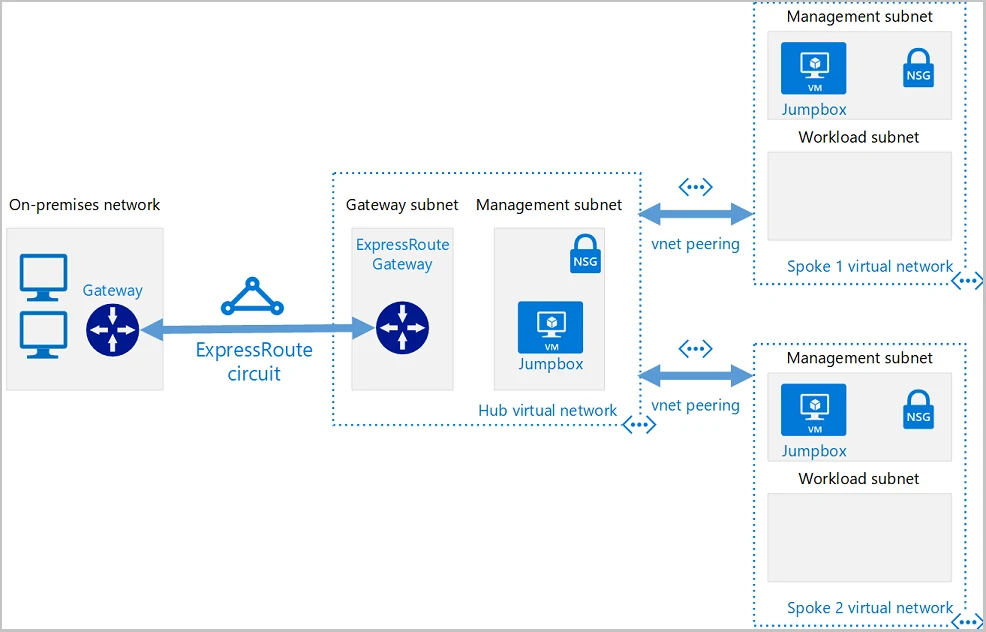

---

schemaVersion: 1
contentType: "guide"
title: "Construye una topología Hub & Spoke en Azure con Terraform"
description: "Despliega un hub, dos spokes y sus peerings con Terraform, valida la topología y entiende qué falta antes de convertirla en una red empresarial."
summary: "Laboratorio Infrastructure as Code para construir Hub & Spoke en Azure con Terraform: VNets, subnets, peerings bidireccionales, outputs, validación y consideraciones para routing centralizado."
category: "Automatización e IaC"
tags: ["Azure", "Terraform", "Hub and Spoke", "Networking", "Infrastructure as Code", "VNet Peering", "Arquitectura Cloud"]
publishedAt: "2026-08-10"
updatedAt: "2026-08-10"
author: "Irving Omar Patron Padron"
draft: false
featured: false
reviewStatus: "approved"
cover: "./microsoft-hub-spoke-terraform.webp"
coverAlt: "Diagrama oficial de Microsoft de una arquitectura Hub and Spoke en Azure con red hub, redes spoke, peering y conectividad híbrida"
imageCredit: "Microsoft Learn — Hub and spoke hybrid network topology with Terraform"
level: "Intermedio"
durationMinutes: 75
prerequisites: ["Suscripción activa de Azure", "Terraform instalado o Azure Cloud Shell", "Azure CLI autenticado", "Conocimientos básicos de Terraform y Azure Networking"]
---

Una de las mejores formas de aprender Hub & Spoke es desplegar una versión pequeña, entender las relaciones y después agregar servicios centrales.

En esta guía utilizarás **Terraform** para crear:

- una VNet Hub;
- dos VNets Spoke;
- subnets;
- peerings bidireccionales;
- outputs para validar el resultado.

No vamos a agregar Azure Firewall todavía. Primero construiremos correctamente la capa de conectividad.



*Imagen: Microsoft Learn, serie oficial Hub & Spoke con Terraform.*

## Arquitectura del laboratorio

Crearemos:

```text
              Hub
          10.60.0.0/16
          /           \
         /             \
   Spoke App         Spoke Data
 10.61.0.0/16       10.62.0.0/16
```

Peerings:

```text
hub-to-app
app-to-hub

hub-to-data
data-to-hub
```

## Importante: qué NO resuelve todavía este laboratorio

Tener los peerings no significa que:

```text
Spoke App → Spoke Data
```

funcione automáticamente.

**VNet Peering no es transitivo.**

Para tráfico spoke-to-spoke necesitas posteriormente diseñar routing mediante Azure Firewall, NVA, Virtual WAN u otro patrón apropiado.

El propósito del laboratorio es separar:

```text
topología
```

de:

```text
routing centralizado
```

## Paso 1. Prepara la carpeta

Crea:

```text
hub-spoke-lab/
├── versions.tf
├── variables.tf
├── network.tf
└── outputs.tf
```

## Paso 2. Configura Terraform y AzureRM

`versions.tf`:

```hcl
terraform {
  required_version = ">= 1.6.0"

  required_providers {
    azurerm = {
      source  = "hashicorp/azurerm"
      version = "~> 4.0"
    }
  }
}

provider "azurerm" {
  features {}
}
```

Antes de usar una restricción de versión en producción, valida la versión aprobada por tu organización.

## Paso 3. Define variables

`variables.tf`:

```hcl
variable "location" {
  description = "Azure region for the lab."
  type        = string
  default     = "mexicocentral"
}

variable "resource_group_name" {
  description = "Resource group name."
  type        = string
  default     = "rg-hub-spoke-lab"
}
```

Si tu suscripción no soporta el recurso requerido en esa región, utiliza otra región disponible.

## Paso 4. Crea el Resource Group

En `network.tf`:

```hcl
resource "azurerm_resource_group" "network" {
  name     = var.resource_group_name
  location = var.location
}
```

## Paso 5. Crea la VNet Hub

```hcl
resource "azurerm_virtual_network" "hub" {
  name                = "vnet-hub"
  location            = azurerm_resource_group.network.location
  resource_group_name = azurerm_resource_group.network.name
  address_space       = ["10.60.0.0/16"]
}

resource "azurerm_subnet" "hub_shared" {
  name                 = "snet-shared"
  resource_group_name  = azurerm_resource_group.network.name
  virtual_network_name = azurerm_virtual_network.hub.name
  address_prefixes     = ["10.60.10.0/24"]
}
```

En una arquitectura real podrías añadir subnets dedicadas para:

- Azure Firewall;
- gateways;
- DNS;
- Bastion;
- otros servicios compartidos.

No crees todas por adelantado sin un diseño.

## Paso 6. Crea Spoke App

```hcl
resource "azurerm_virtual_network" "app" {
  name                = "vnet-spoke-app"
  location            = azurerm_resource_group.network.location
  resource_group_name = azurerm_resource_group.network.name
  address_space       = ["10.61.0.0/16"]
}

resource "azurerm_subnet" "app" {
  name                 = "snet-app"
  resource_group_name  = azurerm_resource_group.network.name
  virtual_network_name = azurerm_virtual_network.app.name
  address_prefixes     = ["10.61.10.0/24"]
}
```

## Paso 7. Crea Spoke Data

```hcl
resource "azurerm_virtual_network" "data" {
  name                = "vnet-spoke-data"
  location            = azurerm_resource_group.network.location
  resource_group_name = azurerm_resource_group.network.name
  address_space       = ["10.62.0.0/16"]
}

resource "azurerm_subnet" "data" {
  name                 = "snet-data"
  resource_group_name  = azurerm_resource_group.network.name
  virtual_network_name = azurerm_virtual_network.data.name
  address_prefixes     = ["10.62.10.0/24"]
}
```

## Paso 8. Crea los peerings Hub ↔ App

```hcl
resource "azurerm_virtual_network_peering" "hub_to_app" {
  name                      = "hub-to-app"
  resource_group_name       = azurerm_resource_group.network.name
  virtual_network_name      = azurerm_virtual_network.hub.name
  remote_virtual_network_id = azurerm_virtual_network.app.id

  allow_virtual_network_access = true
  allow_forwarded_traffic      = true
}

resource "azurerm_virtual_network_peering" "app_to_hub" {
  name                      = "app-to-hub"
  resource_group_name       = azurerm_resource_group.network.name
  virtual_network_name      = azurerm_virtual_network.app.name
  remote_virtual_network_id = azurerm_virtual_network.hub.id

  allow_virtual_network_access = true
  allow_forwarded_traffic      = true
}
```

Habilitamos `allow_forwarded_traffic` porque esta topología está pensada para evolucionar hacia un hub con routing central.

Por sí solo, ese flag **no convierte al hub en router**.

## Paso 9. Crea los peerings Hub ↔ Data

```hcl
resource "azurerm_virtual_network_peering" "hub_to_data" {
  name                      = "hub-to-data"
  resource_group_name       = azurerm_resource_group.network.name
  virtual_network_name      = azurerm_virtual_network.hub.name
  remote_virtual_network_id = azurerm_virtual_network.data.id

  allow_virtual_network_access = true
  allow_forwarded_traffic      = true
}

resource "azurerm_virtual_network_peering" "data_to_hub" {
  name                      = "data-to-hub"
  resource_group_name       = azurerm_resource_group.network.name
  virtual_network_name      = azurerm_virtual_network.data.name
  remote_virtual_network_id = azurerm_virtual_network.hub.id

  allow_virtual_network_access = true
  allow_forwarded_traffic      = true
}
```

## Paso 10. Agrega outputs

`outputs.tf`:

```hcl
output "hub_id" {
  value = azurerm_virtual_network.hub.id
}

output "app_spoke_id" {
  value = azurerm_virtual_network.app.id
}

output "data_spoke_id" {
  value = azurerm_virtual_network.data.id
}
```

## Paso 11. Formatea y valida

Ejecuta:

```bash
terraform fmt -recursive
terraform init
terraform validate
```

Después:

```bash
terraform plan
```

Revisa que Terraform cree únicamente lo esperado.

No ejecutes `apply` si aparecen reemplazos o eliminaciones que no comprendes.

## Paso 12. Despliega

```bash
terraform apply
```

Confirma el plan.

Al terminar:

```bash
terraform output
```

## Paso 13. Valida en Azure

En Portal:

**Virtual networks → vnet-hub → Peerings**

Debes ver:

```text
hub-to-app  Connected
hub-to-data Connected
```

En cada spoke:

```text
app-to-hub  Connected
data-to-hub Connected
```

## Paso 14. Comprueba rutas

Si despliegas VMs de prueba posteriormente, las rutas efectivas de cada spoke incluirán el prefijo del hub.

Pero no verás automáticamente el prefijo del otro spoke como una ruta transitable a través del hub.

Eso es correcto para esta etapa.

## Evolución 1: Azure Firewall

El siguiente diseño puede ser:

```text
Spoke App
    │
    │ UDR
    ▼
Azure Firewall
    │
    ▼
Spoke Data / Internet / On-premises
```

Necesitarías agregar:

- `AzureFirewallSubnet`;
- Azure Firewall;
- Firewall Policy;
- route tables;
- UDR;
- reglas.

## Evolución 2: conectividad híbrida

Si incorporas:

```text
VPN Gateway
```

o:

```text
ExpressRoute Gateway
```

debes revisar:

```text
allow_gateway_transit
use_remote_gateways
```

además del routing de retorno.

## Evolución 3: separar suscripciones

En una landing zone real puede existir:

```text
Connectivity subscription
 └── Hub

Application subscription
 └── Spoke App

Data subscription
 └── Spoke Data
```

Terraform puede manejar recursos en distintas subscriptions mediante providers aliasados y una estrategia adecuada de identidad.

No confundas el laboratorio de una sola suscripción con el diseño enterprise final.

## Remote State

No almacenes un state productivo únicamente en tu laptop.

Cuando conviertas este laboratorio en infraestructura compartida, utiliza un backend remoto y un flujo controlado por pipeline.

Puedes enlazar esta guía con tu contenido de **Terraform Remote State en Azure**.

## Errores frecuentes

### Crear un solo peering

Aunque el portal puede facilitar ambos sentidos, conceptualmente existen relaciones de peering en cada dirección.

### CIDR superpuesto

Terraform puede crear muchos recursos, pero no arregla un mal plan de IPs.

### Esperar transitividad

`allow_forwarded_traffic = true` no crea un router.

### Un state para toda la empresa

Separa states por lifecycle, ownership y blast radius.

### Ejecutar apply desde cualquier laptop

Para producción evoluciona hacia Pull Requests y CI/CD.

## Checklist

- [ ] Terraform `fmt` limpio.
- [ ] `validate` exitoso.
- [ ] Plan revisado.
- [ ] Hub creado.
- [ ] Dos spokes creados.
- [ ] Cuatro peerings `Connected`.
- [ ] CIDRs documentados.
- [ ] Sin traslapes.
- [ ] Routing central pendiente documentado.
- [ ] State remoto considerado antes de producción.

## Limpieza

Terraform facilita retirar el laboratorio:

```bash
terraform plan -destroy
terraform destroy
```

Antes de confirmar verifica que el state no administre recursos compartidos.

## Fuentes oficiales

- [Create a hub and spoke hybrid network topology in Azure using Terraform](https://learn.microsoft.com/en-us/azure/developer/terraform/hub-spoke-introduction)
- [Create a hub virtual network using Terraform](https://learn.microsoft.com/en-us/azure/developer/terraform/hub-spoke-hub-network)
- [Validate a hub and spoke network using Terraform](https://learn.microsoft.com/en-us/azure/developer/terraform/hub-spoke-validation)
- [Hub-spoke network topology in Azure](https://learn.microsoft.com/en-us/azure/architecture/networking/architecture/hub-spoke)
