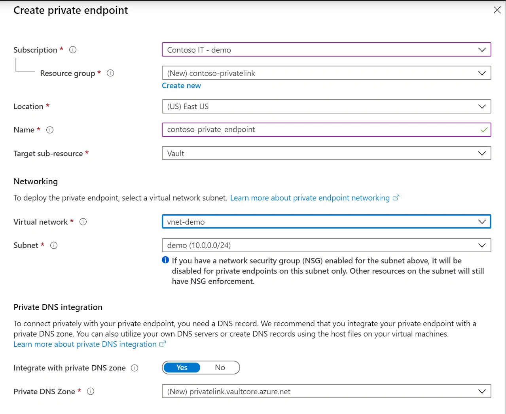

Azure Key Vault almacena secretos, certificados y claves. Proteger el control de identidad es indispensable, pero también puedes limitar **desde qué red** se consume el data plane.

Con **Private Endpoint**, Key Vault obtiene una dirección privada dentro de tu VNet a través de Azure Private Link.

Después puedes deshabilitar el acceso público y consumir:

```text
https://<vault-name>.vault.azure.net/
```

mientras DNS redirige la conexión hacia la IP privada.



*Imagen: Microsoft Learn, integración oficial de Key Vault con Private Link.*

## Objetivo

Al terminar:

```text
VM / App
   │
   │ HTTPS
   ▼
Private Endpoint
10.110.10.x
   │
Private Link
   │
   ▼
Azure Key Vault
```

DNS:

```text
myvault.vault.azure.net
        ↓
myvault.privatelink.vaultcore.azure.net
        ↓
10.110.10.x
```

## Paso 1. Prepara la VNet

Ejemplo:

```text
vnet-secure-services
10.110.0.0/16

snet-private-endpoints
10.110.10.0/24
```

Puedes compartir una subnet de Private Endpoints siguiendo la estrategia de red de tu organización.

No es obligatorio crear una subnet por cada endpoint.

## Paso 2. Crea o selecciona Key Vault

Crea:

```text
kv-patrontech-lab-<unique>
```

Para autorización de datos utiliza el modelo RBAC cuando corresponda a tu estándar.

Agrega un secreto de laboratorio:

```text
Name: demo-secret
Value: patrontech-lab
```

Nunca pongas credenciales reales en un ejercicio.

## Paso 3. Revisa acceso público antes del cambio

En:

**Key Vault → Networking**

observa la configuración actual.

Antes de deshabilitar acceso público confirma que tendrás una ruta privada de administración y consumo.

De lo contrario podrías bloquear tu propia sesión.

## Paso 4. Crea el Private Endpoint

En:

**Networking → Private endpoint connections → Create**

Configura:

```text
Name: pe-keyvault
Virtual network: vnet-secure-services
Subnet: snet-private-endpoints
```

El endpoint y la VNet deben estar en la misma región.

El Key Vault puede estar en una región diferente.

## Paso 5. Integra Private DNS

Conserva la opción de integración DNS cuando corresponda.

Para Key Vault la zona privada habitual es:

```text
privatelink.vaultcore.azure.net
```

La zona debe estar vinculada a la VNet de los clientes.

Comprueba que exista un registro A para el vault apuntando a la IP del endpoint.

## Paso 6. Verifica aprobación

En:

**Private endpoint connections**

esperas:

```text
Connection state: Approved
Provisioning state: Succeeded
```

Si el endpoint apunta a un recurso de otro tenant o existe segregación de ownership, puede requerirse aprobación manual por el propietario.

## Paso 7. Valida DNS

Desde una VM dentro de la red:

```bash
nslookup <vault-name>.vault.azure.net
```

Esperas observar una cadena similar:

```text
<vault-name>.vault.azure.net
       ↓
<vault-name>.privatelink.vaultcore.azure.net
       ↓
10.110.10.x
```

El FQDN que usa la aplicación sigue siendo:

```text
<vault-name>.vault.azure.net
```

No cambies tu aplicación para conectarse directamente a una IP privada.

## Paso 8. Valida TCP/443

En Windows:

```powershell
Test-NetConnection <vault-name>.vault.azure.net -Port 443
```

En Linux:

```bash
curl -I https://<vault-name>.vault.azure.net/
```

Una respuesta HTTP, incluso si requiere autenticación, demuestra que existe conectividad.

## Paso 9. Prueba acceso autenticado

Con Azure CLI:

```bash
az keyvault secret show \
  --vault-name <vault-name> \
  --name demo-secret \
  --query value \
  --output tsv
```

Si la identidad tiene permisos adecuados y DNS/red son correctos, obtendrás:

```text
patrontech-lab
```

## Paso 10. Deshabilita acceso público

Sólo después de validar Private Endpoint:

**Key Vault → Networking**

selecciona:

```text
Disable public access
```

Guarda.

Ahora repite:

```bash
az keyvault secret show ...
```

desde el cliente privado.

Después prueba desde una red que no tenga acceso privado.

El objetivo es comprobar:

```text
red autorizada → funciona
Internet directo → no
```

## Key Vault firewall vs Private Endpoint

Son mecanismos relacionados pero diferentes.

**Firewall/network ACL**

Controla qué redes pueden acceder al endpoint público.

**Private Endpoint**

Proporciona una IP privada dentro de tu VNet.

Si deshabilitas Public Network Access, el consumo del data plane se orienta a Private Link según tu arquitectura.

## DNS híbrido

Para acceso desde on-premises necesitarás:

- VPN o ExpressRoute;
- ruta a la VNet;
- DNS capaz de resolver el nombre privado.

Un diseño típico:

```text
On-prem DNS
    │
conditional forwarding
    │
DNS Private Resolver
    │
Private DNS Zone
    │
Private Endpoint
```

La conectividad física sin DNS correcto sigue produciendo fallas.

## Portal de Azure y Private Endpoint

Algo importante: abrir la página del recurso en Portal no significa que tu navegador ya tenga conectividad al data plane privado.

Algunas operaciones de secretos desde Portal pueden originarse desde tu navegador/contexto de red.

Si deshabilitas acceso público, tu estación de trabajo debe tener una ruta y DNS adecuados para consumir el endpoint privado.

## Trusted services

Key Vault dispone de opciones para permitir determinados servicios de confianza de Microsoft en configuraciones de firewall.

No utilices esta opción sin revisar exactamente:

- qué servicios están incluidos;
- qué parte del flujo se autoriza;
- si realmente necesitas la excepción.

Private Endpoint no convierte automáticamente todas las integraciones PaaS en privadas.

## Checklist

- [ ] Private Endpoint creado.
- [ ] Estado Approved/Succeeded.
- [ ] `privatelink.vaultcore.azure.net` configurada.
- [ ] VNet link correcto.
- [ ] FQDN resuelve a IP privada.
- [ ] TCP/443 funciona.
- [ ] Lectura de secreto funciona.
- [ ] Public access deshabilitado.
- [ ] Acceso desde red no autorizada comprobado.
- [ ] RBAC documentado.

## Troubleshooting

### Sigue resolviendo una IP pública

Revisa:

- Private DNS Zone;
- A record;
- VNet link;
- DNS personalizado;
- conditional forwarders.

### DNS privado funciona, pero recibo Forbidden

Eso suele apuntar a autorización:

- RBAC;
- access policies;
- identidad;
- permisos del secreto.

No cambies networking si el error es de identidad.

### Funciona desde Azure pero no desde on-premises

Revisa:

```text
VPN/ER
→ routing
→ DNS forwarding
→ inbound resolver
→ Private DNS
```

## Limpieza

Para el laboratorio:

1. vuelve a una configuración de red válida si vas a conservar el vault;
2. elimina el secreto de prueba;
3. elimina Private Endpoint;
4. elimina DNS records/zones temporales sólo si no son compartidas.

## Fuentes oficiales

- [Integrate Key Vault with Azure Private Link](https://learn.microsoft.com/en-us/azure/key-vault/general/private-link-service)
- [Diagnose Key Vault Private Link issues](https://learn.microsoft.com/en-us/azure/key-vault/general/private-link-diagnostics)
- [Azure Private Endpoint overview](https://learn.microsoft.com/en-us/azure/private-link/private-endpoint-overview)
- [Key Vault network security](https://learn.microsoft.com/en-us/azure/key-vault/general/network-security)
