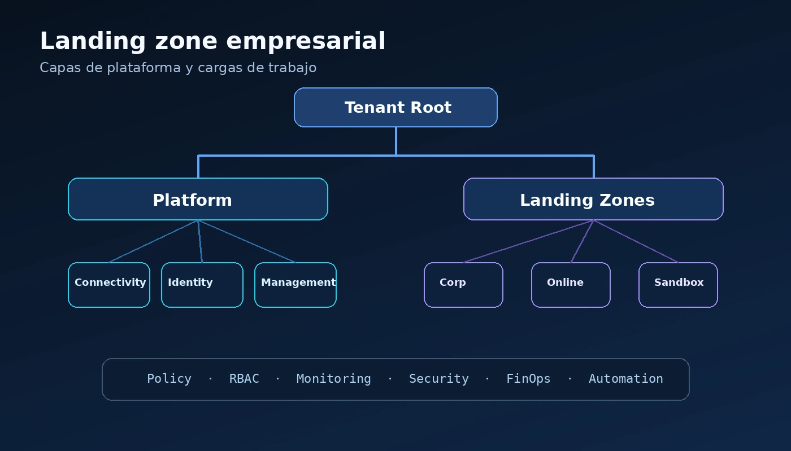

Una landing zone es la base operativa y de gobierno sobre la que se desplegarán las cargas de trabajo. No debe tratarse como una colección de recursos aislados, sino como una plataforma con decisiones explícitas sobre identidad, red, seguridad, operación y costos.



## 1. Comienza por los objetivos

Antes de crear suscripciones o políticas, documenta qué tipos de cargas se alojarán, qué regulaciones aplican, qué regiones se utilizarán y quién será responsable de operar cada componente.

> La mejor landing zone no es la que tiene más controles, sino la que establece controles suficientes, comprensibles y sostenibles.

Una definición inicial debería responder, como mínimo, estas preguntas:

| Decisión | Pregunta de diseño |
|---|---|
| Identidad | ¿Qué tenant, roles y grupos administrarán la plataforma? |
| Suscripciones | ¿Cómo se separarán plataforma, producción y ambientes no productivos? |
| Regiones | ¿Dónde residirán las cargas y cuál será la estrategia de recuperación? |
| Operación | ¿Quién atenderá alertas, respaldos, cambios y capacidad? |
| Costos | ¿Cómo se asignarán presupuestos, etiquetas y responsables? |

## 2. Diseña la estructura de gobierno

Los management groups deben representar necesidades de gobierno, no únicamente el organigrama. Una estructura simple suele ser más sostenible que una jerarquía excesiva.

```text
Tenant Root
├── Platform
│   ├── Connectivity
│   ├── Identity
│   └── Management
└── Landing Zones
    ├── Corp
    └── Online
```

Evita crear niveles que no tengan una razón de política, acceso o cumplimiento. Cada nivel adicional aumenta la complejidad de herencia y diagnóstico.

## 3. Define conectividad y seguridad

Decide desde el inicio si utilizarás hub-and-spoke, Virtual WAN, ExpressRoute, VPN, firewall centralizado y resolución DNS híbrida. Estas decisiones condicionan la mayoría de las migraciones posteriores.

También conviene definir una línea base de seguridad:

- Identidades administradas y privilegio mínimo.
- Políticas preventivas y de auditoría.
- Registro centralizado de actividad y diagnósticos.
- Protección de secretos y llaves.
- Segmentación de red alineada al riesgo.

## 4. Incluye operación y FinOps

Configura diagnósticos, monitoreo, respaldos, actualización, presupuestos, etiquetas y responsables antes de incorporar cargas productivas. La operación no debe agregarse al final.

Un modelo mínimo de etiquetas podría incluir:

```hcl
required_tags = {
  environment = "prod"
  owner       = "cloud-platform"
  cost_center = "technology"
  criticality = "high"
}
```

## 5. Automatiza y valida

La configuración debe quedar en infraestructura como código y pasar por revisión antes de llegar a producción. El pipeline debería validar sintaxis, seguridad, políticas y el plan de cambios.

Empieza con módulos pequeños y contratos claros. Una landing zone no debe convertirse en un repositorio monolítico imposible de actualizar.

## Conclusión

Una landing zone debe evolucionar junto con la organización. Empieza con una arquitectura clara, automatizable y suficientemente flexible para incorporar nuevos controles sin rehacer la plataforma.
