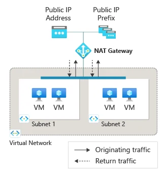

Los workloads privados también necesitan conectividad saliente.

Descargar actualizaciones, consumir APIs o instalar paquetes son ejemplos de conexiones **iniciadas desde Azure hacia Internet**.

**Azure NAT Gateway** proporciona conectividad outbound explícita a nivel de subnet mediante SNAT. Cuando lo asocias a una subnet, pasa a ser el next hop predeterminado para tráfico hacia Internet sin que tengas que crear una UDR adicional.



*Imagen: Microsoft Learn, documentación oficial de Azure NAT Gateway.*

## Objetivo

Tendrás:

```text
Private VM
10.100.10.4
     │
     ▼
Subnet
     │
NAT Gateway
     │ SNAT
     ▼
Static Public IP
     │
     ▼
Internet
```

La VM no tendrá Public IP propia.

## Nota importante sobre outbound en Azure

Microsoft ha evolucionado su modelo de acceso outbound y las nuevas VNets utilizan un enfoque de subnets privadas por defecto.

Por eso debes diseñar **egress explícito** en lugar de depender de comportamientos implícitos.

NAT Gateway es una de las opciones disponibles.

## Paso 1. Prepara la VNet

Ejemplo:

```text
vnet-egress
10.100.0.0/16

snet-workload
10.100.10.0/24
```

Despliega una VM sin Public IP.

## Paso 2. Comprueba que no existe egress alternativo

Antes de agregar NAT Gateway revisa si la subnet ya usa:

- Azure Firewall mediante UDR;
- NVA;
- Load Balancer outbound rules;
- Public IP a nivel de VM.

La coexistencia de múltiples mecanismos requiere entender la prioridad de outbound.

Este laboratorio parte de una subnet sencilla.

## Paso 3. Crea una Public IP

Crea una dirección pública compatible con el SKU de NAT Gateway elegido.

Ejemplo:

```text
pip-nat-egress
```

Para producción puedes considerar Public IP Prefix cuando necesitas un conjunto predecible de IPs.

## Paso 4. Crea NAT Gateway

Ve a:

**NAT gateways → Create**

Nombre:

```text
nat-egress
```

Selecciona SKU de acuerdo con disponibilidad y requerimientos.

La documentación actual contempla:

- **Standard**
- **StandardV2**

StandardV2 incorpora capacidades adicionales, como redundancia entre zonas y soporte IPv6.

No asumas que todos los entornos o regiones tienen exactamente las mismas capacidades disponibles.

## Paso 5. Asocia la Public IP

En NAT Gateway:

**Outbound IP**

asocia:

```text
pip-nat-egress
```

La dirección será utilizada para SNAT de conexiones outbound.

## Paso 6. Asocia la subnet

En:

**NAT Gateway → Subnets**

selecciona:

```text
vnet-egress
snet-workload
```

No necesitas crear:

```text
0.0.0.0/0 → NAT Gateway
```

como UDR.

Cuando está asociado a la subnet, NAT Gateway proporciona automáticamente el outbound correspondiente para Internet.

## Paso 7. Valida la IP de salida

Desde la VM:

```bash
curl https://api.ipify.org
```

o:

```bash
curl https://ifconfig.me
```

El resultado debería coincidir con la Public IP asociada a NAT Gateway.

Para PowerShell:

```powershell
(Invoke-WebRequest -Uri "https://api.ipify.org").Content
```

Esta prueba valida:

```text
VM → subnet → NAT Gateway → Internet
```

## Paso 8. Comprueba que no existe inbound no solicitado

NAT Gateway **no es un servicio para publicar aplicaciones hacia Internet**.

Una conexión iniciada desde Internet hacia la Public IP de NAT Gateway no se traduce hacia una VM arbitraria.

El DNAT se utiliza para paquetes de respuesta asociados a conexiones iniciadas outbound.

Si necesitas inbound usa servicios como:

- Application Gateway;
- Load Balancer;
- Public IP controlada;
- Azure Firewall DNAT;
- Front Door;

según el escenario.

## SNAT ports

Uno de los grandes beneficios de NAT Gateway es su modelo de inventario SNAT.

Los puertos están disponibles bajo demanda para los recursos de las subnets asociadas.

Esto ayuda a reducir problemas típicos de SNAT exhaustion en cargas con gran cantidad de conexiones outbound.

Pero sigue siendo necesario monitorear:

- cantidad de conexiones;
- destinos;
- connection reuse;
- timeouts;
- número de Public IPs.

## Múltiples subnets

Un NAT Gateway puede asociarse a múltiples subnets **de la misma VNet**.

Ejemplo:

```text
vnet-app
├── snet-api ─┐
├── snet-web ─┼→ NAT Gateway
└── snet-jobs ┘
```

No puedes utilizar un único NAT Gateway para subnets pertenecientes a VNets diferentes.

## NAT Gateway y Azure Firewall

Esta combinación requiere diseño.

Si tienes una UDR:

```text
0.0.0.0/0 → Azure Firewall
```

el tráfico sigue la arquitectura de routing hacia el firewall.

No agregues NAT Gateway esperando que sustituya automáticamente una decisión explícita de inspección central.

En diseños de alto volumen, Microsoft documenta patrones donde NAT Gateway puede complementar escenarios de firewall, pero debes evaluar compatibilidad y comportamiento de SNAT.

## Standard vs StandardV2

La documentación vigente incluye dos SKUs.

**Standard**

- IPv4;
- recurso zonal;
- capacidades establecidas de NAT Gateway.

**StandardV2**

- zone redundant por defecto;
- IPv4 e IPv6;
- mayores capacidades de rendimiento;
- NAT64 en escenarios soportados.

La elección productiva debe considerar:

- regiones;
- compatibilidad de Public IP;
- resiliencia;
- IPv6;
- throughput;
- costo.

## Idle timeout

NAT Gateway permite configurar TCP idle timeout dentro de los valores soportados.

Evita incrementar el timeout sin necesidad.

Un timeout muy alto puede mantener puertos ocupados durante más tiempo y empeorar patrones de consumo.

## Checklist

- [ ] VM sin Public IP.
- [ ] NAT Gateway creado.
- [ ] Public IP asociada.
- [ ] Subnet asociada.
- [ ] No existe UDR innecesaria hacia NAT Gateway.
- [ ] IP outbound validada.
- [ ] Inbound no solicitado entendido.
- [ ] SKU documentado.
- [ ] Métricas y costos considerados.

## Troubleshooting

### VM no sale a Internet

Revisa:

1. NSG outbound;
2. UDR;
3. DNS;
4. asociación de subnet;
5. NAT Gateway;
6. estado de Public IP.

### La IP observada no es la del NAT

Comprueba si existe otro mecanismo de egress o si realmente estás probando desde la subnet asociada.

### Quiero recibir conexiones inbound

NAT Gateway no resuelve ese escenario.

Utiliza un servicio de publicación inbound.

## Limpieza

Elimina:

- NAT Gateway;
- Public IP temporal;
- VM de prueba;

o elimina el resource group completo si sólo existe para el laboratorio.

## Fuentes oficiales

- [What is Azure NAT Gateway?](https://learn.microsoft.com/en-us/azure/nat-gateway/nat-overview)
- [NAT Gateway resource](https://learn.microsoft.com/en-us/azure/nat-gateway/nat-gateway-resource)
- [Design virtual networks with NAT Gateway](https://learn.microsoft.com/en-us/azure/nat-gateway/nat-gateway-design)
- [Quickstart: Create NAT Gateway](https://learn.microsoft.com/en-us/azure/nat-gateway/quickstart-create-nat-gateway-portal)
