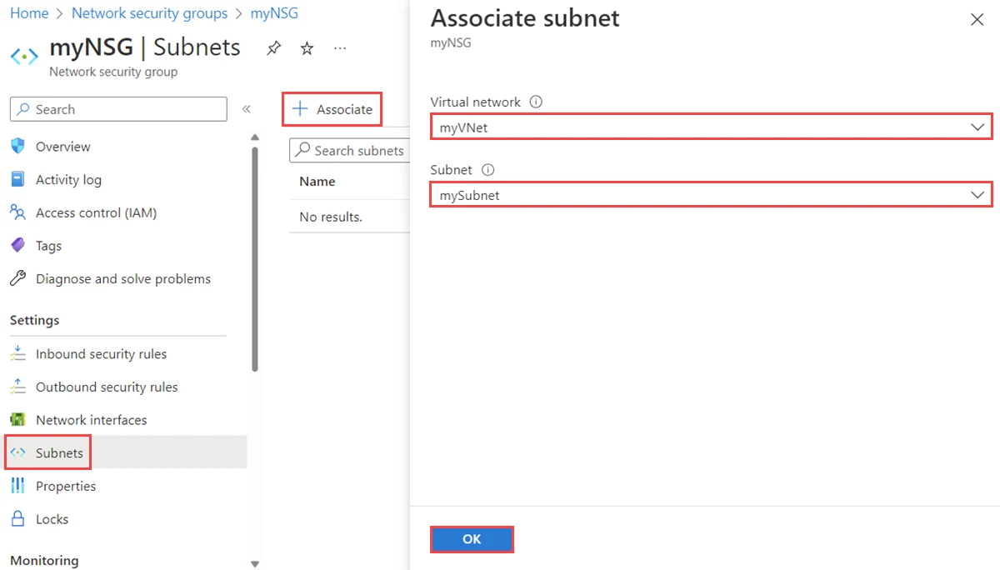

---

schemaVersion: 1
contentType: "guide"
title: "Segmenta una aplicación de tres capas con Network Security Groups"
description: "Aplica Network Security Groups a una arquitectura Web, App y DB, define reglas de mínimo privilegio y valida tráfico permitido y bloqueado."
summary: "Laboratorio para crear NSG, asociarlos a subnets, controlar Web-to-App y App-to-DB, entender prioridades y reglas predeterminadas, y validar Effective Security Rules."
category: "Seguridad y Gobierno"
tags: ["Azure", "NSG", "Network Security Group", "Networking", "Seguridad", "Network Watcher", "Microsegmentación"]
publishedAt: "2026-08-10"
updatedAt: "2026-08-10"
author: "Irving Omar Patron Padron"
draft: false
featured: false
reviewStatus: "approved"
cover: "./microsoft-nsg-subnet.webp"
coverAlt: "Pantalla oficial de Microsoft Azure para asociar un Network Security Group a una subnet de una red virtual"
imageCredit: "Microsoft Learn — Create, change, or delete Azure Network Security Groups"
level: "Inicial"
durationMinutes: 45
prerequisites: ["Suscripción activa de Azure", "Una VNet con tres subnets o capacidad para crearla", "Permisos Network Contributor o equivalentes", "Opcional: VMs de prueba para validar conectividad"]
---

Los **Network Security Groups (NSG)** son uno de los controles fundamentales de segmentación en Azure.

Un NSG contiene reglas stateful que permiten o deniegan tráfico utilizando información como:

- origen;
- destino;
- puerto;
- protocolo;
- dirección;
- prioridad.

En este laboratorio protegerás una aplicación de tres capas:

```text
Web → App → DB
```

y evitarás comunicaciones que la aplicación no necesita.



*Imagen: Microsoft Learn, documentación oficial para administrar NSG.*

## Objetivo

Construiremos:

```text
snet-web
10.90.10.0/24
   │ 443
   ▼
snet-app
10.90.20.0/24
   │ 1433
   ▼
snet-db
10.90.30.0/24
```

Controles:

```text
Internet → Web : 443 permitido
Web → App      : 443 permitido
App → DB       : 1433 permitido
Web → DB       : bloqueado
Internet → DB  : bloqueado
```

Los puertos son ilustrativos. Utiliza los de tu aplicación real.

## Paso 1. Crea la VNet y subnets

Ejemplo:

```text
vnet-three-tier
10.90.0.0/16
```

Subnets:

```text
snet-web  10.90.10.0/24
snet-app  10.90.20.0/24
snet-db   10.90.30.0/24
```

## Paso 2. Crea tres NSG

Crea:

```text
nsg-web
nsg-app
nsg-db
```

Una estrategia de un NSG por subnet ayuda a mantener ownership y troubleshooting claros en este laboratorio.

No significa que cada arquitectura tenga obligatoriamente que seguir esta convención.

## Paso 3. Asocia cada NSG

En:

**Network Security Groups → nsg-web → Subnets → Associate**

selecciona:

```text
vnet-three-tier
snet-web
```

Repite:

```text
nsg-app → snet-app
nsg-db  → snet-db
```

Una subnet sólo puede tener un NSG asociado directamente, aunque las NIC individuales también pueden tener NSG.

Evita aplicar simultáneamente reglas complejas en subnet y NIC si el equipo no puede operar esa doble evaluación con claridad.

## Paso 4. Entiende la prioridad

Las reglas personalizadas utilizan prioridades entre:

```text
100
y
4096
```

El número **menor** tiene prioridad más alta.

Ejemplo:

```text
Priority 100 → Deny
Priority 200 → Allow
```

Si ambas reglas coinciden, gana la regla 100.

Una vez que una regla coincide, Azure deja de evaluar reglas posteriores para esa dirección.

## Paso 5. Configura nsg-web

Permite HTTPS desde Internet:

```text
Name: allow-https-internet
Priority: 200
Source: Internet
Destination: Any
Service: HTTPS
Protocol: TCP
Destination port: 443
Action: Allow
```

Si tu aplicación está detrás de Application Gateway o Front Door, no copies esta regla. El origen permitido debería reflejar el patrón real.

## Paso 6. Configura nsg-app

Permite únicamente el tráfico desde la subnet web hacia el puerto de aplicación:

```text
Name: allow-web-to-app
Priority: 200
Source: 10.90.10.0/24
Destination: 10.90.20.0/24
Protocol: TCP
Destination port: 443
Action: Allow
```

Después puedes crear una regla explícita de denegación si tu modelo requiere impedir otros flujos de VirtualNetwork antes de que alcance una regla predeterminada.

Ejemplo:

```text
Name: deny-other-vnet-in
Priority: 400
Source: VirtualNetwork
Destination: Any
Action: Deny
```

Analiza cuidadosamente el impacto antes de implementar esta regla en ambientes existentes.

## Paso 7. Configura nsg-db

Permite sólo App → DB:

```text
Name: allow-app-to-db
Priority: 200
Source: 10.90.20.0/24
Destination: 10.90.30.0/24
Protocol: TCP
Destination port: 1433
Action: Allow
```

Después bloquea otros flujos internos según el diseño.

Esto evita que la subnet web hable directamente con la base de datos sólo porque ambos recursos pertenecen a la misma VNet.

## Paso 8. Revisa las reglas predeterminadas

Cada NSG incluye reglas como:

```text
AllowVNetInBound
AllowAzureLoadBalancerInBound
DenyAllInBound
```

y sus equivalentes outbound.

No puedes eliminar las reglas predeterminadas.

Tus reglas personalizadas tienen prioridades superiores y pueden modificar el comportamiento antes de que Azure alcance las defaults.

Comprender `AllowVNetInBound` es especialmente importante cuando quieres microsegmentar tráfico dentro de una VNet.

## Paso 9. Prueba los flujos

Con VMs de laboratorio:

Desde Web hacia App:

```powershell
Test-NetConnection 10.90.20.4 -Port 443
```

Esperado:

```text
True
```

Desde App hacia DB:

```powershell
Test-NetConnection 10.90.30.4 -Port 1433
```

Esperado:

```text
True
```

Desde Web directamente a DB:

```powershell
Test-NetConnection 10.90.30.4 -Port 1433
```

Esperado:

```text
False
```

La prueba debe verificar tanto lo que **debe funcionar** como lo que **debe fallar**.

## Paso 10. Revisa Effective Security Rules

En una NIC:

**Network interface → Effective security rules**

Azure combina las reglas aplicables y muestra el resultado efectivo.

Esto es muy útil cuando existe:

- NSG en subnet;
- NSG en NIC;
- varias reglas que parecen superponerse.

## Paso 11. Usa IP Flow Verify

Network Watcher puede evaluar un flujo:

```text
source IP
source port
destination IP
destination port
protocol
direction
```

y mostrar qué regla lo permite o bloquea.

Antes de modificar un NSG en troubleshooting utiliza las herramientas de diagnóstico.

## Los NSG son stateful

Si permites una conexión iniciada outbound, no necesitas crear automáticamente una regla inbound independiente para el tráfico de respuesta.

Azure mantiene estado del flujo.

Esta característica ayuda a evitar reglas redundantes.

## Service Tags

En vez de mantener listas de IPs manuales, determinados escenarios permiten utilizar **Service Tags**.

Ejemplos conocidos:

```text
AzureLoadBalancer
VirtualNetwork
Internet
```

Existen muchos más.

Usa el tag que represente realmente el servicio requerido; no utilices `Internet` como sustituto de una decisión de arquitectura.

## Application Security Groups

Los **ASG** permiten agrupar NICs por función de aplicación.

Por ejemplo:

```text
asg-web
asg-app
asg-db
```

y construir reglas en torno a esos grupos en lugar de mantener IPs explícitas.

Pueden ser útiles en entornos con múltiples VMs que cambian de dirección.

## Errores frecuentes

### Any → Any para resolver un problema

Convierte el NSG en un control prácticamente inútil.

### Reglas duplicadas

Antes de crear una regla nueva revisa prioridades y defaults.

### NSG en subnet y NIC sin documentación

La combinación puede complicar troubleshooting.

### Cambiar una regla y esperar que cierre sesiones existentes

Los cambios de NSG afectan nuevas conexiones; conexiones existentes pueden continuar según el estado del flujo.

## Checklist

- [ ] NSG asociados a subnets correctas.
- [ ] Prioridades documentadas.
- [ ] Internet sólo entra donde es requerido.
- [ ] Web → App permitido.
- [ ] App → DB permitido.
- [ ] Web → DB bloqueado.
- [ ] Effective Security Rules revisadas.
- [ ] IP Flow Verify probado.
- [ ] Reglas Any/Any justificadas o eliminadas.

## Limpieza

Elimina NSG únicamente después de disociarlos de subnets/NICs.

Para laboratorio, eliminar el resource group suele ser la opción más sencilla.

## Fuentes oficiales

- [Azure network security groups overview](https://learn.microsoft.com/en-us/azure/virtual-network/network-security-groups-overview)
- [Create, change or delete a network security group](https://learn.microsoft.com/en-us/azure/virtual-network/manage-network-security-group)
- [Diagnose network security rules](https://learn.microsoft.com/en-us/azure/network-watcher/diagnose-network-security-rules)
- [Application Security Groups](https://learn.microsoft.com/en-us/azure/virtual-network/application-security-groups)
