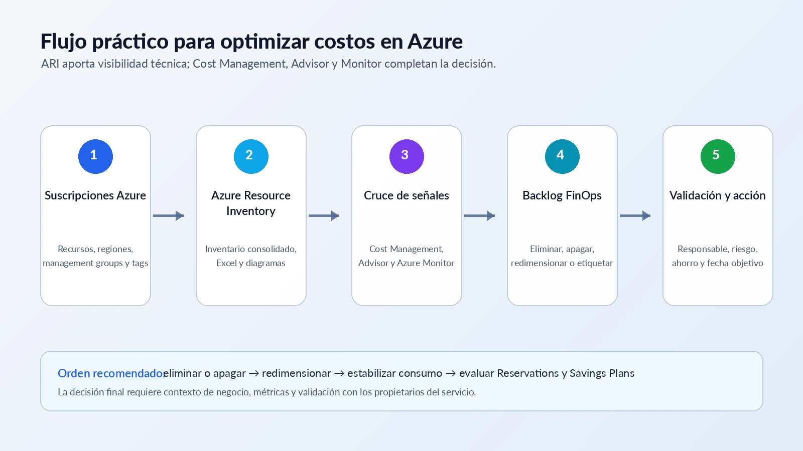
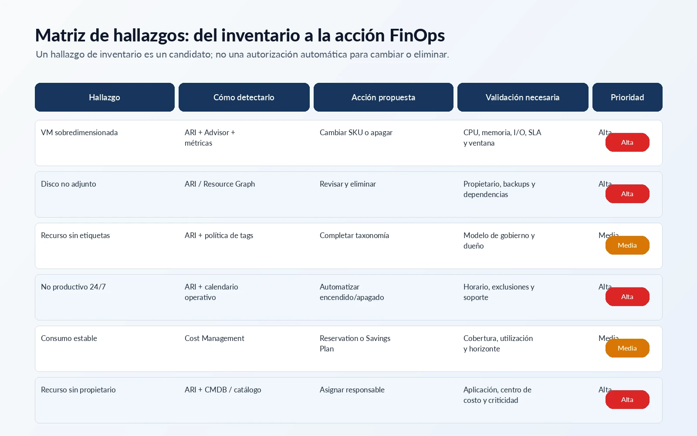

---

schemaVersion: 1
contentType: "guide"
title: "Cómo usar Azure Resource Inventory para un assessment FinOps en Azure"
description: "Guía paso a paso para usar Azure Resource Inventory, analizar un entorno Azure y convertir hallazgos técnicos en un backlog FinOps accionable."
summary: "Ejecuta Azure Resource Inventory, clasifica recursos, cruza hallazgos con Advisor, Cost Management y Monitor, y construye un backlog FinOps con evidencia, responsables y prioridades."
category: "FinOps"
tags: ["Azure", "FinOps", "Azure Resource Inventory", "Azure Advisor", "Cost Management", "Optimización"]
publishedAt: "2026-08-05"
updatedAt: "2026-08-10"
author: "Irving Omar Patron Padron"
draft: false
featured: true
reviewStatus: "approved"
cover: "./cover.webp"
coverAlt: "Assessment FinOps con Azure Resource Inventory conectado con inventario, análisis de costos, validación y acciones de optimización"
level: "Intermedio"
durationMinutes: 60
prerequisites: ["Suscripción Azure o ambiente de laboratorio", "PowerShell 7", "Permisos de lectura sobre el alcance a inventariar", "Acceso a Azure Advisor y Cost Management para validar oportunidades"]
---

Optimizar costos en Azure no comienza comprando una reserva ni reduciendo el tamaño de una máquina virtual. Comienza entendiendo qué existe, quién lo utiliza, cómo está organizado y qué señales indican que un recurso podría estar desperdiciando presupuesto.

Ese primer paso suele ser difícil en entornos con varias suscripciones, equipos, regiones y modelos de operación. **Azure Resource Inventory (ARI)** ayuda a construir esa fotografía técnica mediante un inventario consolidado. Después, ese inventario puede combinarse con **Microsoft Cost Management**, **Azure Advisor**, métricas de **Azure Monitor** y conocimiento del negocio para convertir hallazgos en decisiones.

> ARI aporta visibilidad técnica. No sustituye el análisis financiero, la telemetría ni la aprobación del propietario del servicio.



## ¿Qué es Azure Resource Inventory?

Azure Resource Inventory es una herramienta de código abierto mantenida en GitHub bajo la organización de Microsoft. Se distribuye como un módulo de PowerShell y recopila información de los recursos de Azure para generar reportes, vistas de organización y diagramas que facilitan el análisis del entorno.

Entre sus capacidades más útiles se encuentran:

- inventariar recursos de una o varias suscripciones;
- consolidar propiedades técnicas en un reporte;
- incluir etiquetas para revisar gobierno y asignación;
- representar relaciones de red y estructura organizacional;
- incorporar recomendaciones de Azure Advisor cuando corresponde;
- ejecutarse desde Windows, Linux, macOS o Azure Cloud Shell;
- trabajar con permisos de lectura para la mayoría de los escenarios de inventario.

ARI es especialmente útil cuando el portal de Azure ya no ofrece una vista suficientemente cómoda para revisar cientos o miles de recursos de manera transversal.

## Qué aporta ARI a una iniciativa FinOps

Una iniciativa de optimización necesita responder preguntas concretas:

- ¿Cuántos recursos existen y en qué suscripciones?
- ¿Qué regiones y familias de servicios se utilizan?
- ¿Qué recursos carecen de propietario o centro de costo?
- ¿Qué entornos no productivos permanecen activos todo el día?
- ¿Existen discos, IP públicas, snapshots o componentes que requieren revisión?
- ¿Qué recomendaciones de costo aparecen en Advisor?
- ¿Qué recursos deben analizarse con métricas antes de redimensionar?
- ¿Dónde existe consumo estable que podría ser candidato a un compromiso?

ARI no responde por sí solo todas estas preguntas, pero crea una base técnica consistente para investigarlas.

## Paso 1. Instala y ejecuta Azure Resource Inventory

Antes de comenzar, valida la documentación vigente del repositorio porque parámetros, requisitos y capacidades pueden evolucionar. En un entorno de prueba con PowerShell 7, el flujo general es:

```powershell
Install-Module -Name AzureResourceInventory
Import-Module AzureResourceInventory
Invoke-ARI
```

Para limitar el alcance a una suscripción y solicitar etiquetas:

```powershell
Invoke-ARI `
  -TenantID "<tenant-id>" `
  -SubscriptionID "<subscription-id>" `
  -IncludeTags
```

En organizaciones grandes conviene empezar con una suscripción no productiva, revisar el tiempo de ejecución y confirmar que la identidad utilizada tenga únicamente el acceso necesario.

### Antes de ejecutar en producción

Revisa al menos estos puntos:

1. **Alcance:** tenant, management group o suscripciones específicas.
2. **Identidad:** usuario, service principal o identidad administrada.
3. **Permisos:** lectura sobre los ámbitos que realmente se inventariarán.
4. **Salida:** ubicación segura para almacenar el reporte.
5. **Datos sensibles:** nombres, etiquetas y metadatos que podrían revelar información operativa.
6. **Frecuencia:** ejecución puntual, mensual o integrada en una automatización.

## Paso 2. Analiza el reporte con una metodología FinOps

El reporte no debe convertirse en una lista indiscriminada de recursos para eliminar. La forma más segura es transformar cada hallazgo en un registro de trabajo con evidencia, responsable y validación.

### 2.1 Clasifica recursos y ambientes

Separa los recursos por contexto operativo:

- producción;
- preproducción;
- desarrollo;
- laboratorio;
- servicios compartidos;
- recursos sin clasificación.

Cuando la clasificación no existe en etiquetas, usa temporalmente la suscripción, el resource group y la convención de nombres, pero registra la deuda de gobierno. La meta es que el entorno pueda asignar costos por aplicación, equipo, ambiente y unidad de negocio.

Etiquetas sugeridas:

| Etiqueta | Propósito |
|---|---|
| `Environment` | Producción, pruebas, desarrollo o laboratorio |
| `Application` | Aplicación o servicio de negocio |
| `Owner` | Responsable técnico o funcional |
| `CostCenter` | Centro de costo |
| `BusinessUnit` | Unidad de negocio |
| `Criticality` | Nivel de criticidad |
| `Lifecycle` | Activo, temporal, en retiro o excepción |

### 2.2 Identifica candidatos a eliminación o apagado

ARI ayuda a localizar componentes que merecen revisión, por ejemplo:

- discos administrados no adjuntos;
- direcciones IP públicas sin asociación aparente;
- snapshots antiguos;
- resource groups sin propietario;
- recursos temporales que permanecieron después de una prueba;
- entornos no productivos encendidos fuera del horario requerido;
- servicios duplicados o sin una aplicación identificada.

La palabra importante es **candidato**. Un disco no adjunto puede contener una copia necesaria para recuperación; una IP sin asociación puede reservarse para una migración; un resource group sin actividad reciente puede pertenecer a un proceso crítico poco frecuente.

Antes de eliminar:

1. identifica al propietario;
2. revisa dependencias;
3. confirma la política de respaldo y retención;
4. documenta el ahorro esperado;
5. define una ventana de observación o cuarentena;
6. conserva evidencia de la aprobación.

### 2.3 Cruza el inventario con Azure Advisor

Azure Advisor analiza configuración y telemetría para emitir recomendaciones en categorías como costo, confiabilidad, seguridad, rendimiento y excelencia operativa. En costos puede identificar recursos inactivos o subutilizados y sugerir acciones como apagar, redimensionar o evaluar compromisos.

El inventario de ARI facilita priorizar esas recomendaciones porque agrega contexto:

- suscripción;
- aplicación;
- ambiente;
- región;
- tipo de recurso;
- etiquetas;
- propietario;
- criticidad.

No todas las recomendaciones deben implementarse. Una recomendación se evalúa contra los requisitos del servicio, el SLA, la estacionalidad, el riesgo y el costo de realizar el cambio.

### 2.4 Valida con métricas de Azure Monitor

Para una máquina virtual, CPU baja no siempre significa sobredimensionamiento. También pueden importar:

- memoria disponible;
- IOPS y latencia de disco;
- throughput de red;
- procesos por lotes;
- picos semanales o mensuales;
- requisitos de licencia;
- restricciones de familia o región;
- disponibilidad y recuperación.

Usa una ventana representativa. Un análisis de siete días puede ignorar el cierre contable mensual; uno de treinta días puede no capturar una campaña anual. El periodo debe reflejar el comportamiento real del negocio.

### 2.5 Separa optimización de uso y optimización de tarifa

**Optimización de uso** busca consumir solo lo necesario:

- eliminar recursos;
- apagar fuera de horario;
- redimensionar;
- ajustar retención;
- cambiar niveles de servicio;
- reducir duplicación.

**Optimización de tarifa** reduce el precio del consumo que seguirá existiendo:

- Azure Reservations;
- Azure Savings Plans for Compute;
- Azure Hybrid Benefit;
- precios y acuerdos contractuales aplicables.

Primero limpia y estabiliza el consumo. Después evalúa compromisos. Comprar descuentos sobre una base sobredimensionada reduce la tarifa, pero también puede comprometer presupuesto para desperdicio.

Microsoft recomienda aplicar las acciones de Advisor en este orden:

1. rightsizing o apagado;
2. reservas;
3. savings plans.

Los cambios de tamaño o apagado modifican el patrón de consumo y, por lo tanto, las recomendaciones posteriores de compromiso.

## Paso 3. Construye la matriz de oportunidades



| Hallazgo | Fuente principal | Acción propuesta | Validación mínima |
|---|---|---|---|
| VM sobredimensionada | ARI + Advisor + Azure Monitor | Cambiar SKU o apagar | CPU, memoria, I/O, SLA y ventana |
| Disco no adjunto | ARI + Azure Resource Graph | Revisar y eliminar | Propietario, respaldos y dependencias |
| Recurso sin etiquetas | ARI | Aplicar taxonomía | Modelo de gobierno y responsable |
| No productivo activo 24/7 | ARI + calendario operativo | Automatizar horarios | Excepciones, soporte y procesos batch |
| Consumo estable | Cost Management | Evaluar Reservation o Savings Plan | Cobertura, utilización y horizonte |
| Recurso sin propietario | ARI + CMDB o catálogo | Asignar responsable | Aplicación, centro de costo y criticidad |

## Paso 4. Convierte los hallazgos en un backlog FinOps

El resultado del análisis debería ser un backlog, no únicamente un archivo Excel. Cada oportunidad puede registrar:

| Campo | Ejemplo |
|---|---|
| Recurso | `/subscriptions/.../virtualMachines/vm-app-01` |
| Hallazgo | SKU mayor al uso observado |
| Acción | Evaluar cambio de D8s_v5 a D4s_v5 |
| Ahorro estimado | Valor mensual validado en moneda de facturación |
| Evidencia | Advisor + 60 días de métricas |
| Responsable | Equipo de aplicación |
| Riesgo | Medio |
| Estado | En análisis |
| Fecha objetivo | 2026-08-31 |
| Resultado | Pendiente |

Esta estructura permite medir ahorro potencial, ahorro aprobado y ahorro realizado por separado. Evita presentar como ahorro real una recomendación que todavía no se implementó o cuyo consumo podría reaparecer.

## Errores que debes evitar

### Eliminar recursos solo porque parecen inactivos

La ausencia de relaciones visibles no demuestra que el recurso sea prescindible. Confirma uso, dependencias, respaldos y cumplimiento.

### Comprar reservas antes de redimensionar

Los compromisos deben calcularse sobre una base optimizada y relativamente estable.

### Basar el rightsizing únicamente en CPU

Memoria, disco, red, licenciamiento y picos de negocio pueden ser determinantes.

### Tratar ARI como una CMDB definitiva

ARI representa una fotografía técnica. No reemplaza procesos de gestión de configuración, propiedad, ciclo de vida y control de cambios.

### Ejecutar remediaciones automáticas sin gobierno

La automatización puede ayudar a aplicar horarios, etiquetas o cambios aprobados, pero debe incorporar excepciones, trazabilidad, reversión y responsables.

### Conceder permisos excesivos

Para inventariar, empieza con lectura. Separa la identidad de descubrimiento de cualquier identidad capaz de modificar o eliminar recursos.

## Paso 5. Convierte el assessment en un proceso recurrente

Una adopción progresiva reduce riesgo:

```text
Ejecución manual
→ revisión del reporte
→ taxonomía de hallazgos
→ backlog FinOps
→ ejecución mensual
→ comparación histórica
→ remediación controlada
→ medición del ahorro realizado
```

Un ciclo mensual puede incluir:

1. generar el inventario;
2. importar recomendaciones y costos;
3. comparar cambios contra el inventario anterior;
4. asignar hallazgos a propietarios;
5. aprobar acciones;
6. ejecutar cambios;
7. medir el efecto en la facturación;
8. documentar excepciones.

Para equipos maduros, ARI puede complementarse con Azure Resource Graph, exports de Cost Management, Azure Advisor, el FinOps toolkit y tableros corporativos.

## Conclusión

Azure Resource Inventory es una buena puerta de entrada para mejorar la visibilidad técnica de un entorno Azure. Su mayor valor aparece cuando el inventario se integra en una metodología más amplia:

- **ARI** muestra qué existe y cómo está organizado.
- **Cost Management** muestra cuánto cuesta y cómo se distribuye.
- **Advisor** propone oportunidades basadas en configuración y telemetría.
- **Azure Monitor** aporta evidencia de utilización.
- **Los propietarios del servicio** aportan contexto, riesgo y prioridad.

La optimización sostenible no consiste en reducir costos una sola vez. Consiste en establecer un ciclo repetible de visibilidad, responsabilidad, decisión y medición.

## Fuentes oficiales

- [Azure Resource Inventory — repositorio oficial](https://github.com/microsoft/ARI)
- [Introducción a Azure Advisor](https://learn.microsoft.com/es-es/azure/advisor/advisor-overview)
- [Recomendaciones de costo de Azure Advisor](https://learn.microsoft.com/en-us/azure/advisor/advisor-reference-cost-recommendations)
- [Calcular ahorros en Azure Advisor](https://learn.microsoft.com/en-us/azure/advisor/advisor-how-to-calculate-total-cost-savings)
- [Buenas prácticas de Microsoft Cost Management](https://learn.microsoft.com/en-us/azure/cost-management-billing/costs/cost-mgt-best-practices)
- [Elegir entre Savings Plan y Reservation](https://learn.microsoft.com/en-us/azure/cost-management-billing/savings-plan/decide-between-savings-plan-reservation)
- [FinOps toolkit: Optimization workbook](https://learn.microsoft.com/en-us/cloud-computing/finops/toolkit/workbooks/optimization)
