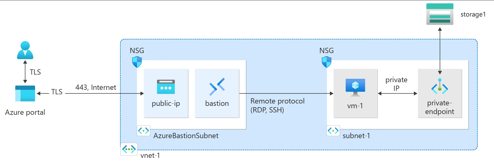

Una Storage Account puede utilizarse sin exponer su acceso de datos a Internet. Con **Azure Private Endpoint**, el servicio obtiene una interfaz de red con una dirección IP privada dentro de tu VNet y el tráfico hacia el recurso utiliza Azure Private Link.

La parte que más problemas genera no suele ser crear el Private Endpoint. Es **DNS**.

En esta guía configurarás el escenario completo y comprobarás que el nombre normal de Azure Storage termine resolviendo hacia la IP privada.



*Imagen: Microsoft Learn, documentación oficial de Azure Private Link.*

## Objetivo

Al terminar tendrás:

```text
Cliente / VM
     │
     │ HTTPS
     ▼
Private Endpoint
10.30.1.x
     │
Azure Private Link
     │
Storage Account
```

y la resolución:

```text
mystorage.blob.core.windows.net
             ↓
mystorage.privatelink.blob.core.windows.net
             ↓
10.30.1.x
```

## Arquitectura del laboratorio

| Recurso | Configuración |
|---|---|
| VNet | `vnet-private-endpoints` |
| CIDR | `10.30.0.0/16` |
| Subnet | `snet-private-endpoints` |
| Subnet CIDR | `10.30.1.0/24` |
| Storage | nombre global único |
| Subrecurso | `blob` |
| Private DNS Zone | `privatelink.blob.core.windows.net` |

## Paso 1. Crea o selecciona la VNet

Puedes usar una VNet existente.

Para laboratorio:

```text
vnet-private-endpoints
10.30.0.0/16

snet-private-endpoints
10.30.1.0/24
```

En producción, evita crear una red sólo porque el wizard lo permite. Integra el endpoint con tu modelo de direccionamiento y DNS existente.

## Paso 2. Crea la Storage Account

Ve a:

**Storage accounts → Create**

Selecciona un nombre globalmente único y la redundancia apropiada para el laboratorio.

Después crea un container Blob:

**Data storage → Containers → + Container**

Por ejemplo:

```text
lab
```

Mantén el acceso anónimo deshabilitado.

## Paso 3. Crea el Private Endpoint

Puedes iniciarlo desde:

**Private Link Center → Private endpoints → Create**

o desde la propia Storage Account.

Selecciona:

```text
Resource type: Microsoft.Storage/storageAccounts
Target sub-resource: blob
```

Después:

```text
Virtual network: vnet-private-endpoints
Subnet: snet-private-endpoints
```

El Private Endpoint creará una NIC de sólo lectura durante su ciclo de vida y utilizará una IP de la subnet.

## Paso 4. Integra Private DNS

En la sección DNS del wizard utiliza integración con Private DNS Zone.

Para Blob Storage:

```text
privatelink.blob.core.windows.net
```

La zona debe estar vinculada a la VNet desde la que los clientes resolverán el nombre.

Conceptualmente:

```text
Private DNS Zone
privatelink.blob.core.windows.net
        │
        └── VNet link
             │
             └── vnet-private-endpoints
```

El registro A del Storage Account debe apuntar a la IP del Private Endpoint.

## Paso 5. Revisa la conexión privada

En la Storage Account:

**Networking → Private endpoint connections**

El estado esperado es:

```text
Approved
```

Si utilizas un workflow manual entre equipos o tenants, el propietario del recurso puede tener que aprobar la conexión.

## Paso 6. Valida DNS antes de deshabilitar acceso público

Desde una VM o workload que utilice el DNS de la VNet:

```bash
nslookup <storage-name>.blob.core.windows.net
```

Debes observar un resultado equivalente a:

```text
Name:
<storage-name>.privatelink.blob.core.windows.net

Address:
10.30.1.x
```

Lo importante no es memorizar la IP.

Lo importante es:

> el FQDN normal de Storage debe terminar resolviendo a la IP privada del Private Endpoint desde el contexto de red correcto.

## Paso 7. Deshabilita Public Network Access

Una vez comprobada la ruta privada:

**Storage Account → Networking**

Configura:

```text
Public network access: Disabled
```

Guarda los cambios.

Ahora el acceso de datos debe realizarse a través del Private Endpoint para los clientes del escenario.

## Paso 8. Valida acceso al servicio

Desde el cliente de prueba puedes usar Azure Storage Explorer o herramientas compatibles.

Valida primero DNS:

```bash
nslookup <storage-name>.blob.core.windows.net
```

Después conexión TCP:

```powershell
Test-NetConnection <storage-name>.blob.core.windows.net -Port 443
```

Y finalmente realiza una operación real contra Blob Storage.

Por ejemplo, si tienes Azure CLI y la autenticación apropiada:

```bash
az storage blob list \
  --account-name <storage-name> \
  --container-name lab \
  --auth-mode login \
  --output table
```

Una prueba técnica completa debe validar:

```text
DNS
→ TCP/443
→ Autenticación
→ Operación de datos
```

## Private Endpoint no es lo mismo que Service Endpoint

Ambos conceptos suelen confundirse.

**Service Endpoint**

La identidad de red de la subnet se extiende hacia el servicio, pero el servicio sigue utilizando su endpoint público.

**Private Endpoint**

El servicio es consumido mediante una IP privada dentro de tu VNet.

Si tu requisito dice:

> “el Storage Account debe ser accesible mediante IP privada y no depender de exposición pública”

Private Endpoint suele ser el patrón relevante.

## Azure Data Lake Storage Gen2: atención con DFS

Si posteriormente habilitas hierarchical namespace y utilizas Azure Data Lake Storage Gen2, Microsoft recomienda considerar endpoints privados para:

```text
blob
dfs
```

Ciertas operaciones del endpoint DFS requieren el endpoint privado correspondiente.

No asumas que un único endpoint `blob` cubre todos los escenarios de ADLS Gen2.

## DNS en Hub & Spoke

En producción puedes tener:

```text
Spoke workload
      │
      ▼
Hub DNS Private Resolver
      │
      ▼
Private DNS Zone
      │
      ▼
Private Endpoint
```

Las zonas privadas pueden centralizarse según el modelo de red, pero debes diseñar correctamente:

- VNet links;
- DNS forwarding;
- resolución desde on-premises;
- resolución entre spokes.

Crear el endpoint sin diseñar DNS es una de las principales causas de fallas.

## Acceso desde on-premises

Un cliente on-premises puede consumir el Private Endpoint si existe conectividad privada hacia la VNet mediante mecanismos como VPN o ExpressRoute y DNS está configurado para resolver el FQDN hacia la dirección privada.

En ese caso debes resolver el dominio privado desde el entorno corporativo, normalmente mediante una estrategia de DNS forwarding.

## NSG y rutas sobre Private Endpoints

Azure permite escenarios de network policies para Private Endpoints en la subnet.

Antes de aplicar NSG o UDR, valida el comportamiento soportado para tu arquitectura y evita agregar controles sin entender su efecto.

No confíes exclusivamente en que el endpoint sea privado: utiliza defensa en profundidad de manera deliberada.

## Checklist

- [ ] Private Endpoint en estado `Approved`.
- [ ] Subrecurso correcto (`blob` en este laboratorio).
- [ ] Zona `privatelink.blob.core.windows.net` creada.
- [ ] VNet vinculada a Private DNS Zone.
- [ ] FQDN resuelve a IP privada.
- [ ] TCP/443 funciona.
- [ ] Operación real de Blob Storage funciona.
- [ ] Public Network Access deshabilitado si es requisito.
- [ ] DNS híbrido documentado si existe on-premises.

## Troubleshooting

### nslookup devuelve una IP pública

Revisa:

1. Private DNS Zone;
2. registro A;
3. VNet link;
4. DNS personalizado;
5. conditional forwarders si existen.

### DNS devuelve IP privada pero Storage Explorer falla

El problema ya no parece puramente DNS.

Revisa:

- TCP/443;
- autenticación;
- RBAC;
- Shared Key/Entra ID según el método;
- firewall local;
- políticas de Storage.

### Funciona desde una VNet pero no desde otra

Comprueba que la segunda red tenga una ruta y una estrategia de resolución DNS hacia la zona privada.

### Funciona Blob pero fallan operaciones Data Lake

Revisa si necesitas también un Private Endpoint para `dfs`.

## Limpieza

Para un laboratorio dedicado puedes eliminar el resource group.

Si la Storage Account contiene información real, elimina únicamente:

- Private Endpoint;
- DNS records o zone links creados para el laboratorio;
- recursos temporales.

No elimines una Private DNS Zone compartida sin verificar qué otros servicios dependen de ella.

## Fuentes oficiales

- [Tutorial: Connect to a storage account using an Azure Private Endpoint](https://learn.microsoft.com/en-us/azure/private-link/tutorial-private-endpoint-storage-portal)
- [Use private endpoints for Azure Storage](https://learn.microsoft.com/en-us/azure/storage/common/storage-private-endpoints)
- [Private Endpoint DNS configuration](https://learn.microsoft.com/en-us/azure/private-link/private-endpoint-dns)
- [What is a private endpoint?](https://learn.microsoft.com/en-us/azure/private-link/private-endpoint-overview)
