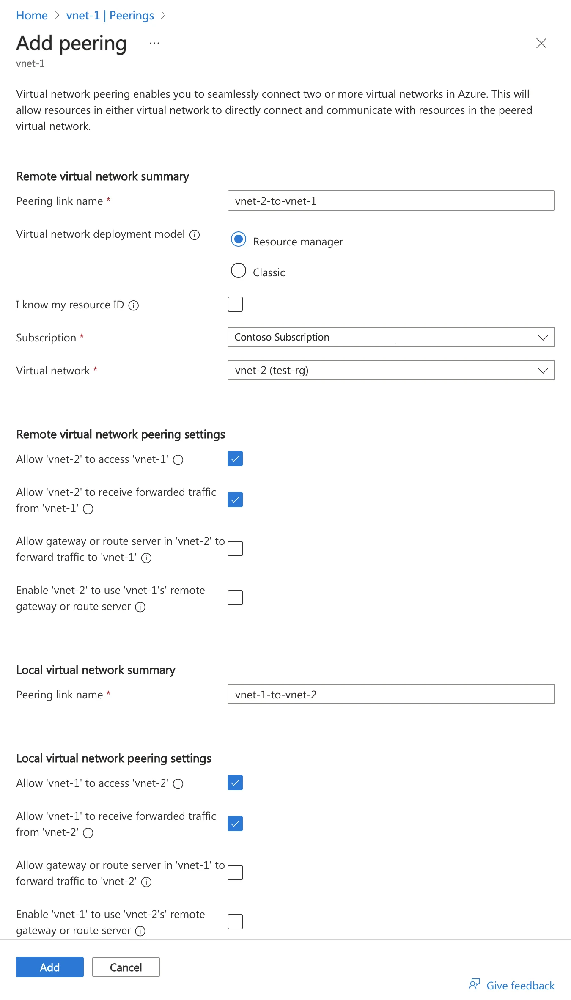

---

schemaVersion: 1
contentType: "guide"
title: "Conecta redes de Azure con VNet Peering: laboratorio y validación"
description: "Configura VNet Peering entre dos redes de Azure, valida conectividad, revisa sus opciones clave y aprende a detectar errores frecuentes."
summary: "Laboratorio práctico para conectar dos VNets con Azure Virtual Network Peering, comprobar el estado Connected, validar tráfico privado y entender forwarded traffic, gateway transit y límites de transitividad."
category: "Azure"
tags: ["Azure", "VNet Peering", "Networking", "Virtual Network", "Network Watcher", "Arquitectura Cloud"]
publishedAt: "2026-08-10"
updatedAt: "2026-08-10"
author: "Irving Omar Patron Padron"
draft: false
featured: false
reviewStatus: "approved"
cover: "./microsoft-vnet-peering.webp"
coverAlt: "Pantalla oficial de Microsoft Azure para agregar un emparejamiento entre dos redes virtuales y configurar sus opciones de conectividad"
imageCredit: "Microsoft Learn — Tutorial: Connect virtual networks with virtual network peering"
level: "Inicial"
durationMinutes: 35
prerequisites: ["Suscripción activa de Azure", "Permisos para crear o modificar Virtual Networks", "Dos VNets con rangos IP que no se traslapen", "Acceso al Azure Portal"]
---

Conectar aplicaciones distribuidas en diferentes redes virtuales es una necesidad muy frecuente en Azure. **Virtual Network Peering** permite establecer conectividad privada entre dos VNets utilizando el backbone de Microsoft, sin necesitar una VPN entre ellas.

En este laboratorio conectarás dos redes, revisarás las opciones que realmente importan y comprobarás que el peering quedó operativo.

> **Resultado esperado:** dos VNets con estado de peering `Connected` capaces de intercambiar tráfico privado de acuerdo con sus NSG y rutas.



*Imagen: Microsoft Learn, documentación oficial de Azure Virtual Network Peering.*

## Arquitectura del laboratorio

Utilizaremos este direccionamiento:

| Recurso | Dirección |
|---|---|
| `vnet-app` | `10.10.0.0/16` |
| `snet-app` | `10.10.1.0/24` |
| `vnet-data` | `10.20.0.0/16` |
| `snet-data` | `10.20.1.0/24` |

La regla más importante antes de empezar es simple:

> **Las redes que vas a emparejar no deben tener espacios de direcciones superpuestos.**

Azure permite peering entre VNets de la misma región y también **Global VNet Peering** entre regiones compatibles.

## Paso 1. Revisa los espacios de direcciones

En Azure Portal:

1. abre **Virtual networks**;
2. entra a `vnet-app`;
3. revisa **Address space**;
4. repite con `vnet-data`.

Debes comprobar que:

```text
10.10.0.0/16
```

y:

```text
10.20.0.0/16
```

no se traslapen.

Si las redes se superponen, el peering no es la solución hasta corregir el plan de direccionamiento.

## Paso 2. Crea el peering

Abre:

**Virtual networks → vnet-app → Peerings → Add**

Usa nombres claros:

```text
vnet-app-to-vnet-data
vnet-data-to-vnet-app
```

En el portal actual puedes crear ambos sentidos como parte del mismo flujo si tienes permisos en ambas VNets.

### Opciones relevantes

Encontrarás configuraciones similares a estas:

**Allow virtual network access**

Debe estar habilitado cuando quieres permitir conectividad normal entre ambas VNets.

**Allow forwarded traffic**

Permite aceptar tráfico que no se originó directamente en la VNet remota. Es importante cuando existe:

- Azure Firewall;
- una NVA;
- routing centralizado;
- escenarios Hub & Spoke.

No lo habilites únicamente porque “suena necesario”. Debe responder a tu arquitectura.

**Allow gateway transit**

Permite que una VNet con gateway comparta ese gateway con la VNet emparejada.

**Use remote gateways**

Permite que la VNet consumidora utilice el gateway de su peer.

Estas dos últimas opciones son especialmente relevantes en Hub & Spoke.

## Paso 3. Confirma el estado Connected

Una vez creado el peering, revisa:

**Virtual Network → Peerings**

El estado esperado es:

```text
Connected
```

Si creaste cada dirección por separado, podrías observar temporalmente:

```text
Initiated
```

hasta completar el peering inverso.

También puedes validarlo con Azure CLI:

```bash
az network vnet peering list \
  --resource-group <resource-group> \
  --vnet-name vnet-app \
  --output table
```

Revisa la columna:

```text
PeeringState
```

Debe mostrar:

```text
Connected
```

## Paso 4. Valida las rutas

El peering agrega rutas de sistema para permitir que Azure conozca los prefijos de la VNet remota.

En una NIC de prueba puedes revisar:

**Networking → Network settings → Effective routes**

Deberías encontrar el prefijo remoto asociado a una ruta de tipo:

```text
Virtual network peering
```

Para `vnet-app`, por ejemplo:

```text
10.20.0.0/16
```

debería ser alcanzable a través del peering.

## Paso 5. Prueba conectividad real

La validación más útil consiste en tener una VM de prueba en cada VNet sin IP pública.

Ejemplo:

```text
vm-app  → 10.10.1.4
vm-data → 10.20.1.4
```

Desde `vm-app`:

```bash
ping -c 4 10.20.1.4
```

O prueba un puerto específico:

```bash
nc -vz 10.20.1.4 22
```

En Windows:

```powershell
Test-NetConnection 10.20.1.4 -Port 3389
```

Si ICMP no funciona, no asumas inmediatamente que el peering está roto. Los sistemas operativos y NSG pueden bloquear ICMP.

## Paso 6. Usa Network Watcher para troubleshooting

Azure Network Watcher puede ayudarte a diferenciar entre:

- problema de peering;
- NSG;
- ruta;
- puerto;
- configuración del sistema operativo.

Herramientas útiles:

- **Connection troubleshoot**
- **IP flow verify**
- **Next hop**
- **Effective routes**
- **Effective security rules**

Un buen troubleshooting de red evita cambiar cinco componentes al mismo tiempo.

## VNet Peering no es transitivo

Este concepto es fundamental.

Supón:

```text
Spoke A ←→ Hub ←→ Spoke B
```

Que `Spoke A` esté emparejado con `Hub` y `Spoke B` también esté emparejado con `Hub` **no significa que A y B puedan comunicarse automáticamente a través del hub**.

El peering no ofrece transitividad por sí mismo.

Para tráfico spoke-to-spoke normalmente necesitas un mecanismo de routing como:

- Azure Firewall;
- NVA;
- Virtual WAN;
- otras capacidades de routing según la arquitectura.

Esto explica por qué un Hub & Spoke empresarial requiere algo más que crear peerings.

## Gateway transit

Un caso común:

```text
On-premises
     │
ExpressRoute / VPN
     │
    Hub
     │
   Spoke
```

El hub puede tener un gateway y compartirlo con spokes.

En términos conceptuales:

**Hub side**

```text
Allow gateway transit = Enabled
```

**Spoke side**

```text
Use remote gateways = Enabled
```

No puedes utilizar simultáneamente un gateway local y un remote gateway en la misma VNet para este escenario.

## ¿Qué ocurre con los NSG?

Peering establece conectividad de red, pero **no elimina los controles de seguridad**.

Un NSG puede seguir bloqueando:

```text
10.10.1.4 → 10.20.1.4:443
```

aunque el peering esté `Connected`.

Por eso el diagnóstico debe comprobar:

```text
Peering
→ Routing
→ NSG
→ Firewall/NVA
→ Sistema operativo
→ Aplicación
```

## Peering entre suscripciones

Las VNets pueden pertenecer a suscripciones diferentes.

Necesitas permisos suficientes para crear la relación sobre cada VNet. Esto es habitual en arquitecturas donde:

```text
Subscription Connectivity
        │
        ├── Hub
        │
Subscription App A
        └── Spoke A
```

La separación de suscripciones no impide utilizar peering.

## Checklist de validación

Antes de cerrar el cambio:

- [ ] Los CIDR no se traslapan.
- [ ] Ambos peerings están `Connected`.
- [ ] Las rutas efectivas contienen el prefijo remoto.
- [ ] NSG permiten únicamente el tráfico requerido.
- [ ] Las aplicaciones responden por IP privada.
- [ ] `Allow forwarded traffic` está habilitado sólo si la arquitectura lo requiere.
- [ ] Gateway transit está documentado si aplica.
- [ ] El flujo está registrado en el diagrama de red.

## Errores frecuentes

### Peering Connected pero no hay comunicación

Revisa NSG, rutas y firewall del sistema operativo.

### Forwarded traffic deshabilitado

Puede afectar diseños con Azure Firewall o NVA.

### CIDR superpuesto

No intentes resolver un problema de direccionamiento agregando rutas adicionales.

### Asumir transitividad

Hub & Spoke no obtiene spoke-to-spoke automáticamente sólo por tener dos peerings.

### Probar únicamente con ping

Una aplicación puede funcionar aunque ICMP esté bloqueado. Prueba el puerto real del servicio.

## Limpieza del laboratorio

Si las VNets son exclusivamente de laboratorio, elimina el resource group.

Si compartes las VNets con otros workloads, elimina únicamente los peerings creados y verifica dependencias antes de hacerlo.

## Siguiente paso

Después de dominar VNet Peering, el siguiente ejercicio natural es construir una topología **Hub & Spoke** y controlar cómo se mueve el tráfico entre spokes.

## Fuentes oficiales

- [Azure Virtual Network Peering](https://learn.microsoft.com/en-us/azure/virtual-network/virtual-network-peering-overview)
- [Tutorial: Connect virtual networks with peering](https://learn.microsoft.com/en-us/azure/virtual-network/tutorial-connect-virtual-networks)
- [Create, change or delete VNet peering](https://learn.microsoft.com/en-us/azure/virtual-network/virtual-network-manage-peering)
